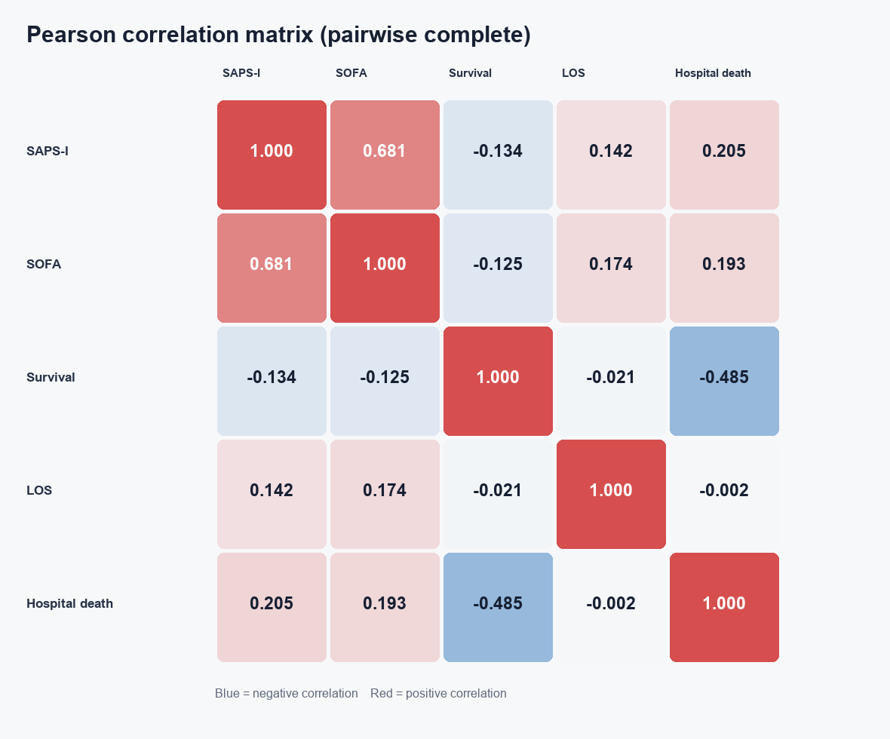
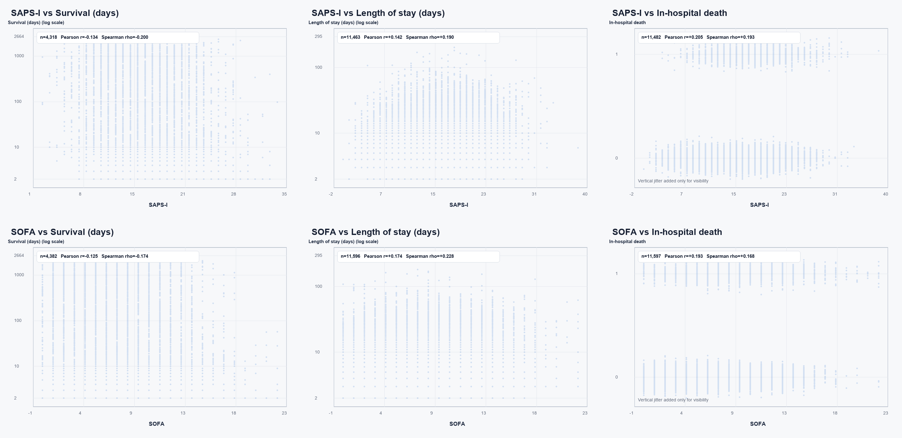

# SAPS-I、SOFA 与结局变量的相关性

数据源为 `release/outcomes.csv`。`SAPS-I=-1`、`SOFA=-1` 和 `Length_of_stay=-1` 按缺失处理；`Survival=-1` 表示没有记录死亡时间，不进入死亡时间相关性。依据数据说明，死亡时间和住院时间小于 2 天的异常值也不参与相应计算。所有相关系数均采用成对完整样本，因此不同单元格的样本量可能不同。

## Pearson 相关性矩阵

| | SAPS-I | SOFA | Survival | Length_of_stay | In-hospital_death |
|---|---:|---:|---:|---:|---:|
| SAPS-I | 1.000 | 0.681 | -0.134 | 0.142 | 0.205 |
| SOFA | 0.681 | 1.000 | -0.125 | 0.174 | 0.193 |
| Survival | -0.134 | -0.125 | 1.000 | -0.021 | -0.485 |
| Length_of_stay | 0.142 | 0.174 | -0.021 | 1.000 | -0.002 |
| In-hospital_death | 0.205 | 0.193 | -0.485 | -0.002 | 1.000 |

## Spearman 相关性矩阵

| | SAPS-I | SOFA | Survival | Length_of_stay | In-hospital_death |
|---|---:|---:|---:|---:|---:|
| SAPS-I | 1.000 | 0.689 | -0.200 | 0.190 | 0.193 |
| SOFA | 0.689 | 1.000 | -0.174 | 0.228 | 0.168 |
| Survival | -0.200 | -0.174 | 1.000 | 0.203 | -0.796 |
| Length_of_stay | 0.190 | 0.228 | 0.203 | 1.000 | -0.034 |
| In-hospital_death | 0.193 | 0.168 | -0.796 | -0.034 | 1.000 |

## 两项评分与三个结局变量

| 评分 | 结局 | 有效样本量 | Pearson r | Spearman rho |
|---|---|---:|---:|---:|
| SAPS-I | Survival | 4,318 | -0.134 | -0.200 |
| SAPS-I | Length_of_stay | 11,463 | +0.142 | +0.190 |
| SAPS-I | In-hospital_death | 11,482 | +0.205 | +0.193 |
| SOFA | Survival | 4,382 | -0.125 | -0.174 |
| SOFA | Length_of_stay | 11,596 | +0.174 | +0.228 |
| SOFA | In-hospital_death | 11,597 | +0.193 | +0.168 |

死亡时间和住院时间使用对数纵轴显示，但图中标注的相关系数是在原始天数上计算的。是否死亡为二元变量，散点图仅为显示而加入了少量纵向抖动；其 Pearson 系数等价于点二列相关系数。

`Survival` 的相关性只描述“有有效死亡时间记录”的患者，不能代表全部 12,000 位患者的总体生存关系。相关性也不等于因果关系，SAPS-I 与 SOFA 之间共享部分生理测量，因此二者本身存在结构性相关。
