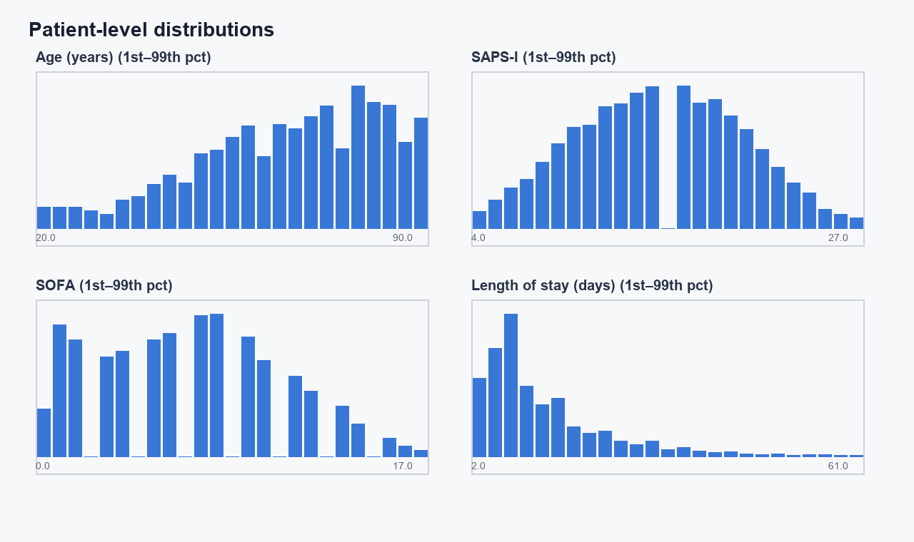
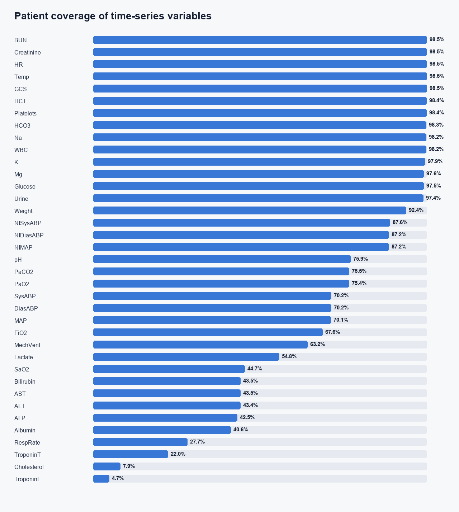
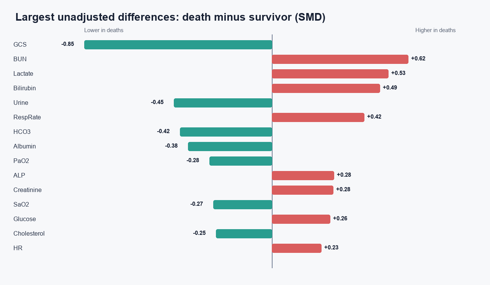

# ICU 数据探索性分析（EDA）

本报告由 `eda.py` 从 `release/` 原始文件生成。分析只读取原始数据；所有数值 `-1` 均按缺失处理。时序指标的组间比较基于“每位患者该指标在前 48 小时内的平均值”，属于未经混杂因素调整的描述性结果，不能解释为因果关系。

## 数据完整性

- ICU 记录文件：12,000
- 结局记录：12,000
- 重复结局 ID：0
- 找不到结局的 ICU 记录：0
- 找不到 ICU 文件的结局记录：0
- `Parameter` 为空、无法归类并已排除的观测：2,403 行，涉及 1,594 个文件
- 结局表中违反数据说明取值约束的记录：95 条（详见 `outcome_anomalies.csv`）
- 院内死亡：1,707（14.22%）；存活出院：10,293（85.78%）

## 结局与评分字段

| 字段 | missing_count | missing_rate |
|---|---|---|
| SAPS-I | 518 | 4.32% |
| SOFA | 403 | 3.36% |
| Length_of_stay | 167 | 1.39% |
| Survival | 7410 | 61.75% |

`In-hospital_death` 没有缺失。SAPS-I、SOFA 和住院时长存在少量缺失；`Survival=-1` 的含义是没有记录到死亡时间，与其他列的一般缺失语义需要分开理解。

此外，`RecordID=100348` 的 `Survival=-23`，另有少数 `Length_of_stay` 或 `Survival` 为 0/1，与数据说明中“住院少于 48 小时者已排除”的约束不一致。本报告在生存时间分布中排除了负数异常值，但未改写原始文件。

## 静态变量

- 年龄中位数：67.0 岁；1%–99% 分位数：20.0–90.0 岁。
- 女性：5,261；男性：6,727；性别缺失：12。
- ICU 类型计数：CCU=1,769，CSRU=2,530，MICU=4,293，SICU=3,408。
- 身高缺失率：47.72%；入院体重缺失率：8.34%。

## 时序指标覆盖率

覆盖率表示 12,000 位患者中至少出现一次有效测量的比例。测量密集程度与临床状态、ICU 类型和医生检查决策有关，因此“是否测量”本身可能携带预测信息。

覆盖率最高的指标：

| Parameter | patients_observed | patient_coverage_rate | median_observations_per_observed_patient |
|---|---|---|---|
| BUN | 11,817 | 98.47% | 3.0 |
| Creatinine | 11,817 | 98.47% | 3.0 |
| HR | 11,816 | 98.47% | 55.0 |
| Temp | 11,815 | 98.46% | 14.0 |
| GCS | 11,815 | 98.46% | 13.0 |
| HCT | 11,810 | 98.42% | 4.0 |
| Platelets | 11,802 | 98.35% | 3.0 |
| HCO3 | 11,793 | 98.28% | 3.0 |

覆盖率最低的指标：

| Parameter | patients_observed | patient_coverage_rate | median_observations_per_observed_patient |
|---|---|---|---|
| TroponinI | 565 | 4.71% | 2.0 |
| Cholesterol | 948 | 7.90% | 1.0 |
| TroponinT | 2,637 | 21.98% | 2.0 |
| RespRate | 3,328 | 27.73% | 49.0 |
| Albumin | 4,871 | 40.59% | 1.0 |
| ALP | 5,097 | 42.48% | 1.0 |
| ALT | 5,213 | 43.44% | 1.0 |
| AST | 5,214 | 43.45% | 1.0 |

## 院内死亡与存活组的描述性差异

下表按标准化均值差（SMD）的绝对值排序。正值表示死亡组的患者级平均测量值更高，负值表示更低。SMD 只用于描述和筛选候选变量，并未控制年龄、ICU 类型、测量频率或病情严重程度。

| Parameter | survivor_patient_mean_median | death_patient_mean_median | standardized_mean_difference_death_minus_survivor | coverage_rate_difference_death_minus_survivor |
|---|---|---|---|---|
| GCS | 12.9 | 9.12 | -0.852 | -0.05% |
| BUN | 17.8 | 28 | +0.619 | +1.37% |
| Lactate | 1.84 | 2.22 | +0.529 | +19.09% |
| Bilirubin | 0.7 | 0.9 | +0.490 | +19.08% |
| Urine | 118 | 75 | -0.445 | -0.88% |
| RespRate | 18.9 | 20.9 | +0.419 | -14.85% |
| HCO3 | 24 | 22 | -0.417 | +1.53% |
| Albumin | 3 | 2.73 | -0.382 | +17.22% |
| PaO2 | 142 | 124 | -0.284 | +12.98% |
| ALP | 75.6 | 89 | +0.282 | +17.89% |

## 建模前需要保留的结论

1. 标签存在明显但不极端的类别不平衡，后续评价应优先报告 AUROC、AUPRC、召回率与校准，而不是只报告准确率。
2. 数据是不规则采样的长时序，不宜直接把缺失值填成 0。建议同时保留数值、缺失指示、距上次测量时间和测量次数。
3. 极少测量的变量可能仍有强临床价值，但其缺失模式很可能带有检查选择偏倚。
4. 本报告保留原始极值并在分布图中使用 1%–99% 范围显示；正式建模前应逐项制定生理合理范围，而不是统一截断。
5. SAPS-I 和 SOFA 是已计算的综合评分。如果目标是公平比较机器学习模型与传统评分，应把它们作为基线而非普通输入特征。
6. 字段名为空的 2,403 行不能根据数值猜测其检测项目，后续特征工程应继续排除，并保留数据质量记录。
7. 原始极值中存在明显可疑值，例如 `Temp=-17.8`、`pH=735`、`WBC=12500`。此外，`MechVent` 的有效记录只有 1，没有显式的 0；不能把“未记录”直接解释为“没有机械通气”。

## 输出文件

- `time_series_variable_summary.csv`：每个时序指标的覆盖率、测量次数、缺失行和分位数。
- `variable_comparison_by_outcome.csv`：死亡组与存活组的患者级均值、覆盖率和 SMD。
- `static_variable_summary.csv`、`static_comparison_by_outcome.csv`：静态变量摘要。
- `outcomes_summary.csv`、`outcomes_missingness.csv`：结局字段摘要。
- `outcome_anomalies.csv`：违反结局字段取值约束的记录。
- `observation_count_by_hour.csv`：前 48 小时逐小时有效观测数。
