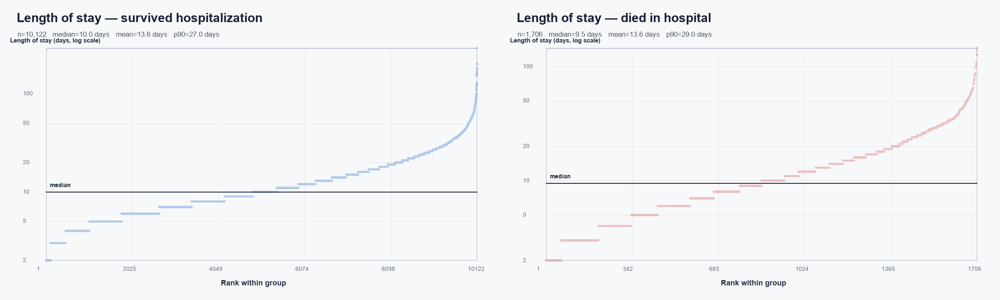

# 实验 01：按院内死亡状态拆分住院时间

## 目的

将 `Length_of_stay` 按 `In-hospital_death` 拆分为存活出院组和院内死亡组，观察两组住院时间的分布。这个实验只做描述性比较，不进行因果解释或预测建模。

## 数据处理

- 数据源：`release/outcomes.csv`。
- `Length_of_stay=-1` 或缺失的 167 条记录不参与分析。
- 住院时间小于 2 天、与数据集纳入条件不一致的 5 条记录作为异常值排除。
- 两份患者级拆分数据生成在 `output/data/`，为避免重新分发原始患者级数据，不上传 GitHub；代码、汇总统计和图表上传。
- 散点图横轴是组内按住院时间排序后的样本序号，纵轴是住院时间。由于住院时间明显右偏，纵轴使用对数尺度。

## 结果

| 分组 | 有效样本量 | 平均住院时间 | 中位数 | 第25–75百分位 | 第90百分位 | 最大值 |
|---|---:|---:|---:|---:|---:|---:|
| 存活出院 | 10,122 | 13.64天 | 10.0天 | 6.0–17.0天 | 27.0天 | 295天 |
| 院内死亡 | 1,706 | 13.58天 | 9.5天 | 5.0–17.0天 | 29.0天 | 146天 |

## 初步解释

两组都具有明显的右偏和长尾，少数患者的住院时间远高于大多数患者。这里的 `Length_of_stay` 是从进入 ICU 到整个住院结束的时间，不等同于 ICU 内停留时间。是否院内死亡也不是住院时间的唯一决定因素，后续实验需要加入年龄、ICU 类型、SAPS-I、SOFA 和前 48 小时临床状态进行控制或建模。
