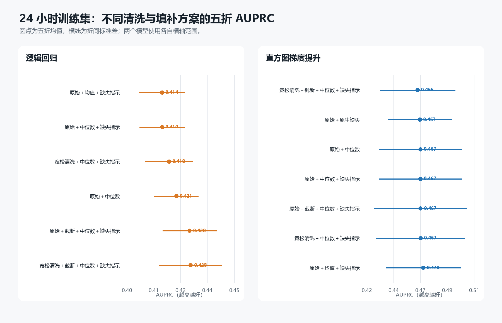
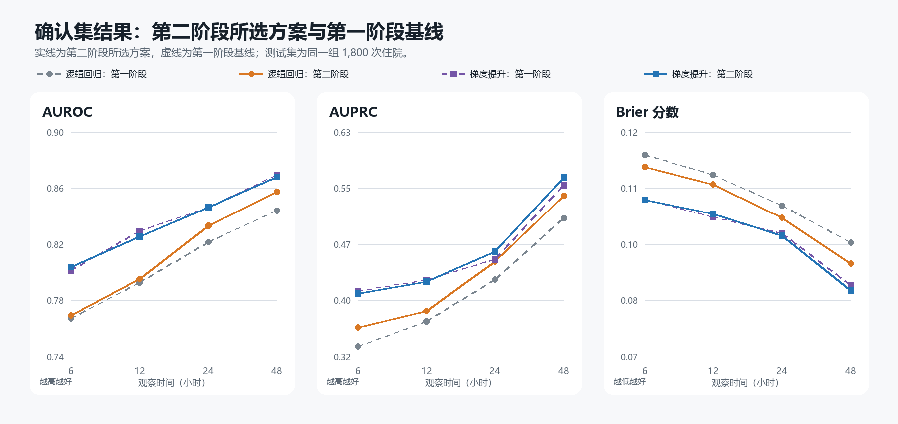
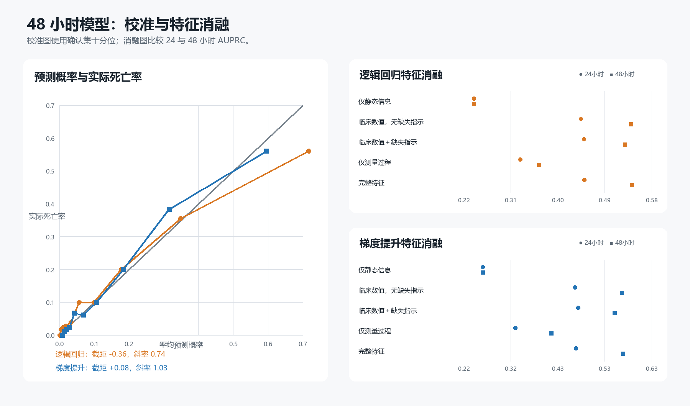
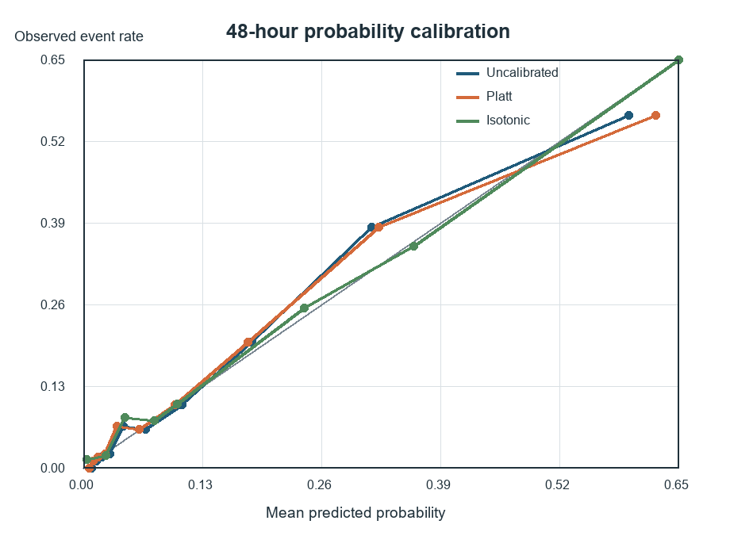
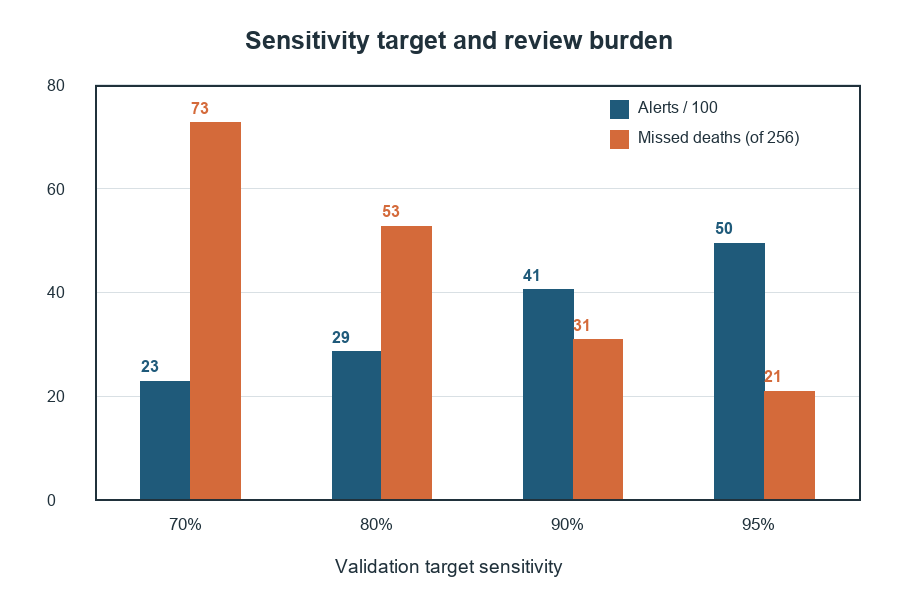
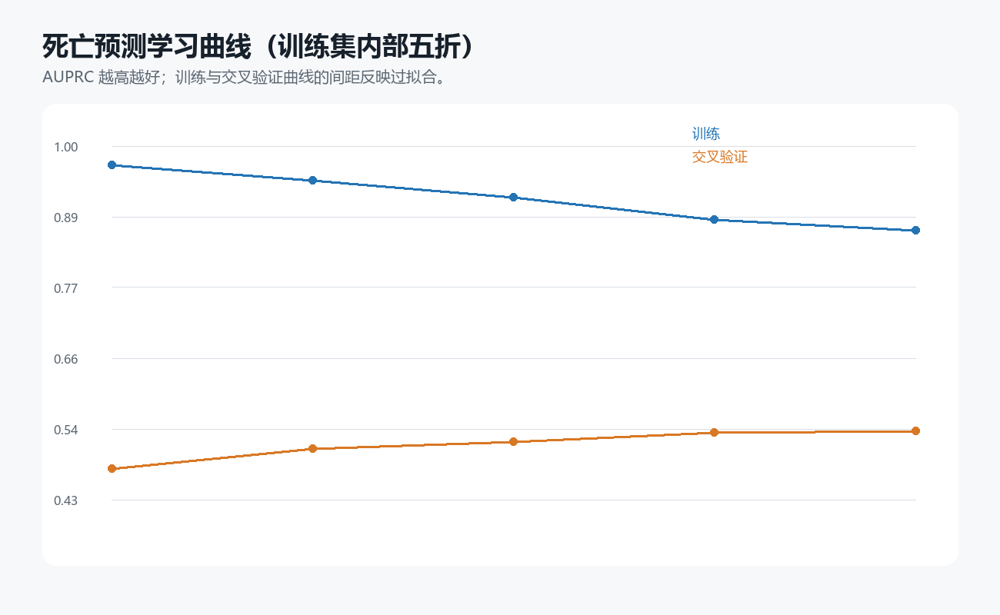
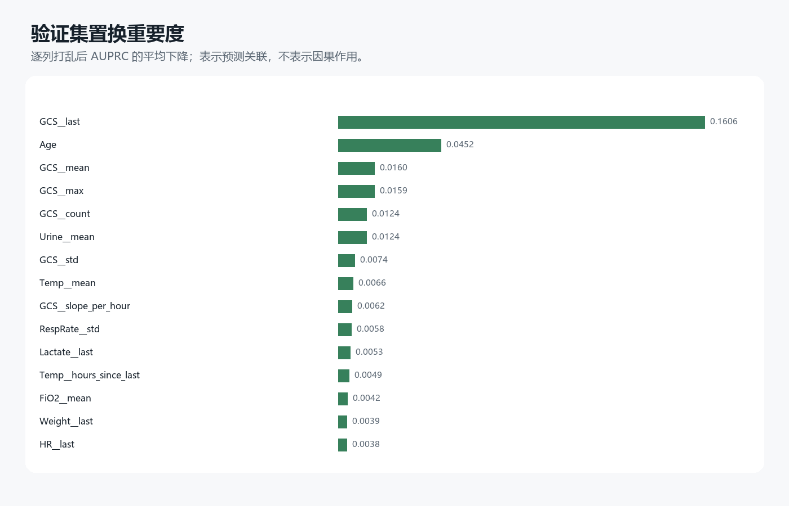
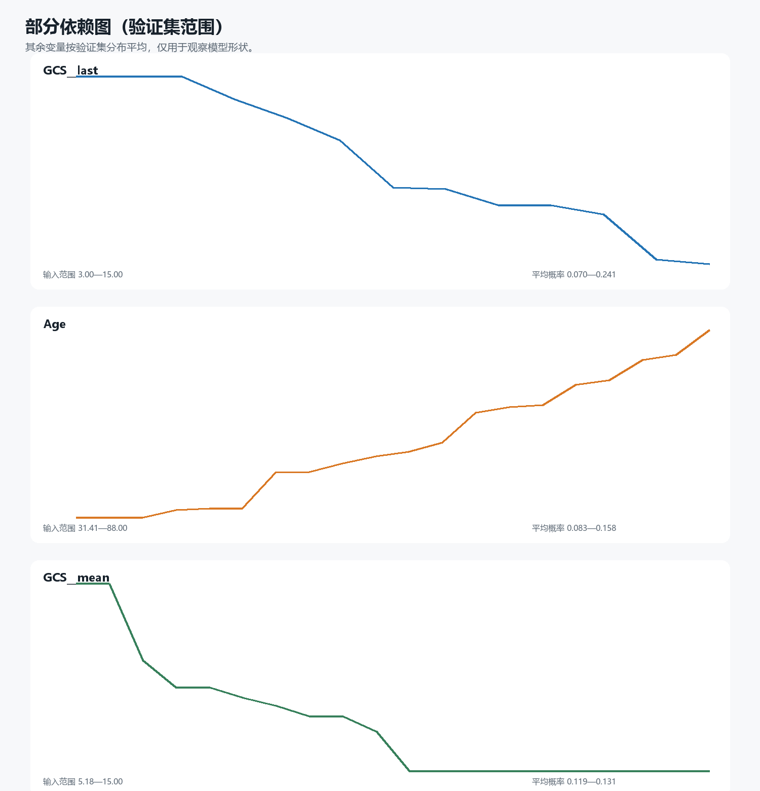

# 实验 03：院内死亡模型的数据填补与清洗稳健性

## 研究目的

本实验延续实验 02 的院内死亡二分类主线，不改变研究队列、预测标签、6/12/24/48 小时观察窗、341 个基础特征和患者级划分，只考察数据清洗与缺失处理方式是否会稳定改变模型表现。全量队列仍为 12,000 次 ICU 住院，其中死亡 1,707 例；训练集、验证集和确认集分别为 8,400、1,800 和 1,800 例，随机种子统一为 42。

这里把最后一部分称为“基线后重新锁定的确认集”，因为实验 02 已经查看过同一测试集的基线结果。它仍可用于固定条件下的配对比较，但不能再描述为研究全过程中从未查看过的独立盲测集。

## 预处理方案与实验流程

宽松清洗只把明显违反单位或技术可行范围的值改为缺失，例如体温不在 25–45 ℃、pH 不在 6.5–8.0、血压不大于 0 或超过 300 mmHg。边界有意留得较宽，临床上严重但仍可能真实的异常值不会被删除。Winsorization 的 0.5% 和 99.5% 分位点、中位数、均值以及缺失指示均只在当前训练折拟合，验证集和确认集不会参与这些参数的估计。

| 方案 | 含义 |
|---|---|
| `raw_median` | 原始基线规则后，以训练集中的中位数填补，不另加缺失指示 |
| `raw_median_indicator` | 中位数填补并加入缺失指示，即实验 02 的主要预处理 |
| `raw_mean_indicator` | 均值填补并加入缺失指示 |
| `raw_native_missing` | 仅供梯度提升使用，直接保留缺失值 |
| `raw_winsor_median_indicator` | 原始数据先按训练集分位点截断，再做中位数填补和缺失指示 |
| `clean_median_indicator` | 先做宽松技术边界清洗，再做中位数填补和缺失指示 |
| `clean_winsor_median_indicator` | 同时使用宽松清洗、训练集分位数截断、中位数填补和缺失指示 |

筛选分三步进行。第一步只在 24 小时训练集内进行五折分层交叉验证，以 AUPRC 为主要指标，同时观察 AUROC 和 Brier；第二步让每个模型排名靠前的两个方案以及既有基线进入全部四个时间窗的验证集比较；第三步按四个时间窗的平均验证 AUPRC 选择每个模型的一种方案，以 Brier 作为同分时的约束，并在验证集固定 Youden 阈值后只评价一次确认集。确认集指标使用 1,000 次住院记录级 Bootstrap 给出 95% 置信区间。

## 清洗实际影响

宽松边界共触发 5,749 次变量清洗，主要来自有创收缩压 1,891 次、有创舒张压 1,882 次、无创收缩压 552 次、体重 354 次、无创舒张压 307 次和体温 298 次。这里统计的是“变量—规则触发次数”，`InitialWeight` 与 0 时刻 `Weight` 可能对应同一来源，因此不能把 5,749 直接解释成互不重叠的原始行数。完整逐变量计数见 [`output/cleaning_counts.csv`](output/cleaning_counts.csv)。

这些数量也说明了一个限制：血压中的零值既可能是设备或录入问题，也可能是接口用来表达未连接监测的编码。当前实验把它们作为不可能的生理测量转为缺失，但不会据此声称所有来源错误已经被医学审核确认。

## 24 小时训练集五折筛选



逻辑回归的最高五折 AUPRC 为宽松清洗、分位数截断、中位数填补与缺失指示组合的 0.4282，原始数据加分位数截断为 0.4276，二者差异小于折间波动。梯度提升最高的是原始数据、均值填补并加入缺失指示的 0.4697；其余方案约为 0.4650—0.4675，没有形成明显、稳定的差距。

| 模型 | 训练集五折排名第一 | AUROC | AUPRC | Brier |
|---|---|---:|---:|---:|
| 逻辑回归 | 宽松清洗＋分位数截断＋中位数＋缺失指示 | 0.8099 | 0.4282 | 0.1034 |
| 梯度提升 | 原始＋均值＋缺失指示 | 0.8370 | 0.4697 | 0.0961 |

验证集跨四个时间窗汇总后，逻辑回归最终选择 `raw_winsor_median_indicator`，梯度提升选择 `raw_mean_indicator`。这两个选择来自验证集，不是根据下面的确认集结果反向决定。

## 确认集结果与第一阶段比较



| 模型 | 时间窗 | AUROC（95% CI） | AUPRC（95% CI） | Brier（95% CI） | 灵敏度 | 特异度 |
|---|---:|---:|---:|---:|---:|---:|
| 逻辑回归 | 6h | 0.769（0.738–0.798） | 0.360（0.305–0.426） | 0.109（0.098–0.120） | 0.684 | 0.693 |
| 逻辑回归 | 12h | 0.795（0.765–0.824） | 0.383（0.330–0.452） | 0.106（0.095–0.116） | 0.715 | 0.755 |
| 逻辑回归 | 24h | 0.833（0.808–0.859） | 0.451（0.394–0.517） | 0.100（0.090–0.110） | 0.828 | 0.712 |
| 逻辑回归 | 48h | 0.857（0.833–0.880） | 0.542（0.474–0.609） | 0.092（0.083–0.101） | 0.816 | 0.749 |
| 梯度提升 | 6h | 0.804（0.777–0.829） | 0.407（0.348–0.472） | 0.103（0.093–0.113） | 0.848 | 0.609 |
| 梯度提升 | 12h | 0.825（0.801–0.850） | 0.423（0.363–0.492） | 0.100（0.091–0.110） | 0.715 | 0.775 |
| 梯度提升 | 24h | 0.846（0.826–0.866） | 0.465（0.409–0.530） | 0.097（0.087–0.106） | 0.770 | 0.762 |
| 梯度提升 | 48h | 0.868（0.846–0.888） | 0.567（0.500–0.631） | 0.087（0.079–0.096） | 0.805 | 0.784 |

与统一种子后的实验 02 相比，所选逻辑回归在 48 小时的 AUPRC 由 0.511 提高至 0.542，Brier 由 0.0953 降至 0.0916；所选梯度提升的 AUPRC 由 0.557 提高至 0.567，Brier 由 0.0877 降至 0.0868。改善幅度较小，而且不同时间窗并不一致。结合置信区间和五折波动，本实验支持把预处理选择视为稳健性优化，而不支持把某一种复杂清洗描述成普遍优越。

## 校准与测量行为消融



48 小时逻辑回归的校准截距为 −0.358、斜率为 0.743，提示预测概率偏高且略显极端；梯度提升的截距为 +0.081、斜率为 1.033，整体更接近理想的 0 和 1。内部校准较好仍不能代替外部数据验证，尤其当病例构成和测量流程发生变化时。四个时间窗的参数与十分位曲线分别见 [`output/calibration_metrics.csv`](output/calibration_metrics.csv) 和 [`output/calibration_curve.csv`](output/calibration_curve.csv)。

消融实验把 341 个基础特征拆成静态信息、临床数值统计、显式缺失指示，以及由测量次数和距末次测量时间构成的测量过程特征。仅使用测量过程时，48 小时逻辑回归和梯度提升的 AUPRC 分别为 0.364 和 0.411，说明临床检查与复查行为本身含有风险信号，但仍明显低于完整模型的 0.542 和 0.567。梯度提升去掉测量过程后 AUPRC 为 0.566，与完整模型接近；因此当前结果更适合说明测量行为具有信息，而不能证明它在 48 小时主模型中带来稳定增益。

## 结局标签敏感性

95 条硬规则异常在训练集、验证集和确认集中分别有 61、16 和 18 条。以相同的“排除硬异常确认集”评价时，48 小时梯度提升在使用全部官方标签训练和排除异常后重训的 AUROC/AUPRC 分别为 0.861/0.526 与 0.859/0.523，差异较小。少量结局异常没有改变“48 小时梯度提升最好”的总体排序，但某些中间时间窗和非线性模型对样本删除仍可能更敏感。

另外按照死亡日期与住院时长的差值 2、5、10 天做了逐级敏感性分析。由于这会选择性删除死亡病例并降低阳性率，AUPRC 和 Brier 会随人群基线风险变化，不能与主分析直接作数值高低比较；更适合观察 AUROC、模型排序和结论方向是否发生突变。完整结果见 [`output/label_sensitivity_metrics.csv`](output/label_sensitivity_metrics.csv)。

## 亚组结果

48 小时梯度提升在女性和男性中的 AUROC 分别为 0.863 和 0.872；在 `<45`、`45–64`、`65–79`、`≥80` 岁组中分别为 0.926、0.905、0.832 和 0.817。不同 ICU 类型的 AUROC 为 0.807–0.897，其中 CSRU 的死亡率只有 4.0%，因此 AUPRC 会受到亚组患病率的明显影响，不能脱离样本量和死亡率比较。当前亚组未做多重比较校正和置信区间估计，只用于发现可能的性能异质性，不能作为公平性或临床适用性的定论。明细见 [`output/subgroup_metrics.csv`](output/subgroup_metrics.csv)。

## 补充：工作点、再校准与跨 ICU 压力测试

这部分只扩展最终的 48 小时梯度提升模型，不重复前面的预处理筛选、消融、亚组和标签实验。未校准模型的 Brier 为 0.08677；Platt 和 isotonic 分别为 0.08691 和 0.08702，均未改善测试集 Brier，isotonic 还把 AUPRC 从 0.567 降至 0.532。因此当前内部结果不支持把再校准作为性能改进；它仍可在新医院出现系统性风险偏移时重新评估，但必须使用独立校准数据。



验证集目标灵敏度从 0.70 提高到 0.95 时，确认集实际灵敏度由 0.715 增至 0.918，每 100 人告警数由 23.0 增至 49.7，漏诊死亡人数由 73 降至 21。它把阈值选择转化为复核容量与漏诊之间的权衡；当前没有真实干预成本和净获益数据，因此不指定唯一“临床最佳阈值”。完整结果见 [`output/threshold_operating_points.csv`](output/threshold_operating_points.csv)。



留一 ICU 类型压力测试在三类 ICU 上重新训练、在第四类 ICU 的全部记录上评价，并移除 ICU 类型输入。四类留出结果的 AUROC 为 0.805–0.876；平均预测风险在 CSRU 从实际 4.9% 高估到 9.6%，在 MICU 从实际 19.8% 低估到 15.8%。这比固定确认集亚组分析更接近分布变化，但四类 ICU 仍来自同一数据来源，只能称为内部可迁移性压力测试。明细见 [`output/leave_one_icu_out.csv`](output/leave_one_icu_out.csv)。

## 结论

第二阶段最稳妥的结论是：简单预处理已经足以支撑当前梯度提升基线，宽松异常清洗、分位数截断、均值填补和原生缺失都没有产生跨模型、跨时间窗的一致增益。逻辑回归在部分时间窗可从清洗与截断中获得小幅改善，但差异落在当前抽样不确定性范围内。缺失与测量频率含有真实预测信息，同时也可能编码医院工作流程，因此后续外部验证时应把这类特征视为潜在的分布漂移来源。

## 复现

```bash
python Experiments/03_mortality_data_quality/run_experiment.py --data-dir ../release
python Experiments/03_mortality_data_quality/analyze_selected_models.py --data-dir ../release
python Experiments/03_mortality_data_quality/analyze_operating_points.py
python Experiments/03_mortality_data_quality/plot_results.py
python Experiments/03_mortality_data_quality/test_run_experiment.py
python Experiments/03_mortality_data_quality/test_analyze_operating_points.py
```

主脚本会重新读取 12,000 份 ICU 文件；两项补充分析直接使用被 Git 忽略的 `output/data/feature_profiles.npz`。患者级特征和预测不提交到仓库，聚合指标、图表和运行元数据可以复现本报告中的结论。

## 课程对齐补充：模型调优、学习曲线与解释

补充实验沿用 48 小时输入和固定 8,400/1,800/1,800 划分。实验叙述按一般流程组织：先以逻辑回归作为简单基线，再与梯度提升比较；每个模型只在训练集五折中选择超参数，随后由验证集 AUPRC 确定模型家族，固定测试集只评价最终方案一次。逻辑回归比较 `C=0.01—10` 及是否使用 `class_weight='balanced'`，梯度提升比较学习率、叶节点数和 L2 正则。验证集选择学习率 0.03、最多 15 个叶节点、L2=1 的梯度提升；合并训练集和验证集重拟合后，测试集 AUROC/AUPRC/Brier 为 0.874/0.579/0.0862。与主模型 0.868/0.567/0.0868 相比，判别能力有小幅改善，概率误差近似持平，因而应描述为有限增益而非决定性提升。

学习曲线显示，训练样本由 1,344 增至 6,720 时，五折 AUPRC 从 0.475 上升到 0.538，但训练分数仍明显更高，提示模型同时受到样本量和过拟合影响。置换重要度和部分依赖改为解释正文采用的 `raw_mean_indicator` 主梯度提升模型，不再解释另一个调优管线；采用完整验证集并增加到五次重复后，可以避免先前整体负值图形带来的误解。主逻辑回归另输出标准化系数和每 1 个标准差对应的优势比。相关特征会分摊重要度，系数和重要度都只描述当前模型中的预测关联，不能解释为治疗或生理因果效应。







主逻辑回归的完整系数和优势比见 [`output/course_extension/logistic_coefficients_odds_ratios.csv`](output/course_extension/logistic_coefficients_odds_ratios.csv)。
