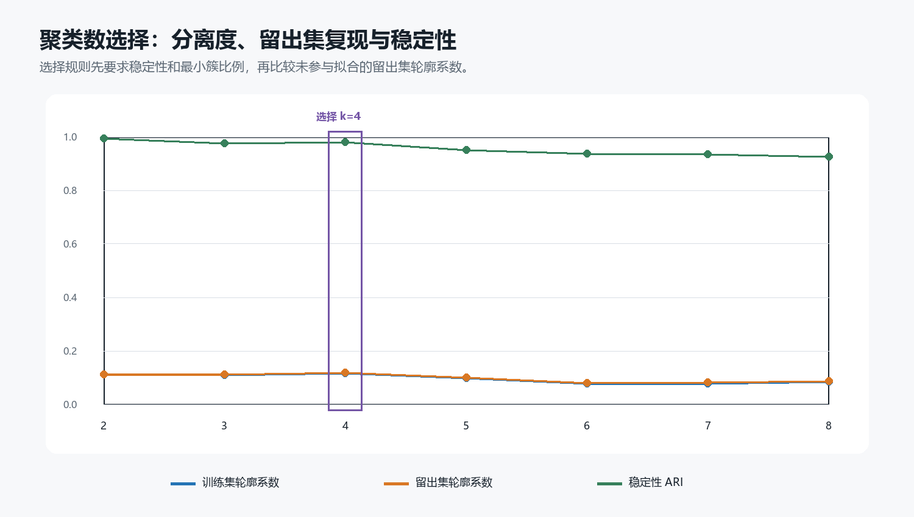
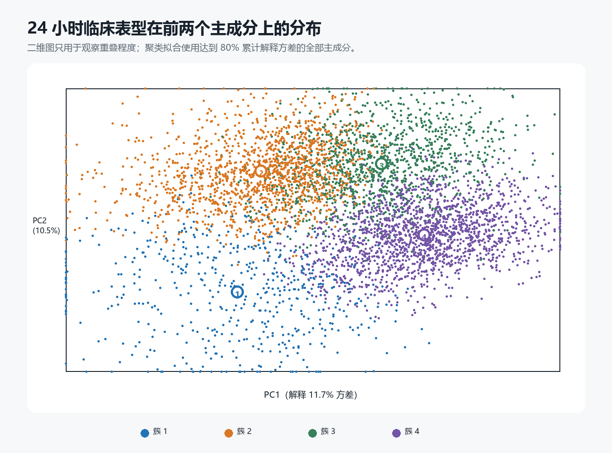
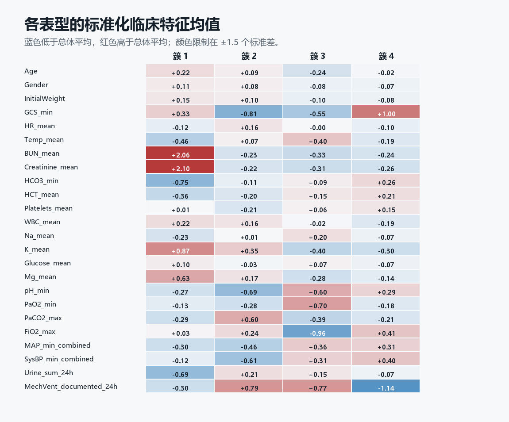

# 实验 05：24 小时患者表型聚类

## 研究问题与变量选择

本实验尝试回答：在不使用任何结局标签的情况下，患者入 ICU 后 24 小时的临床状态能否形成相对稳定的亚群。输入由年龄、性别、初始体重，以及神经状态、生命体征、血压、肾功能、血常规、电解质、血气、机械通气和记录尿量等共 24 个特征组成。有创和无创血压先分别清除低于宽松技术合理性下限的近零值（MAP 10 mmHg、收缩压 20 mmHg），再取可用通道中的较低值。机械通气原始变量在本数据中只出现数值 1，因此这里把它解释为“24 小时内是否记录到机械通气”，不能据此确认未记录者一定没有接受通气。SAPS-I、SOFA、院内死亡、生存时间和住院时长均未参与预处理、PCA、聚类或簇数选择；其余检验次数和距上次测量时间也被排除，以减少按医疗流程而非生理状态分组的风险。

## 方法

全部 12,000 次住院先按 ICU 类型分层，划为 70% 聚类训练集和 30% 留出集。1% 和 99% 分位截尾、中位数填补与标准化都只从训练集估计。PCA 把相关变量旋转成互相正交的主成分，本次保留 14 个主成分，累计解释 81.1% 的训练集方差。K-means 随后寻找 k 个中心，使每位患者到所属中心的平方距离之和尽量小，因此这里的“同一簇”表示标准化临床状态更接近，并不自动等同于一种疾病。

更直观地写，标准化先把不同单位的变量放到相近尺度；PCA 寻找能保留尽可能多总体变异的正交方向；K-means 最小化 $\sum_i\|z_i-\mu_{c_i}\|^2$，其中 $z_i$ 是患者的主成分坐标，$\mu_{c_i}$ 是所属簇中心。平方距离使极端值影响较大，因此截尾和仅用训练集估计预处理参数是聚类流程的一部分，而不是事后修饰。

候选 k 为 2–8。每个 k 都计算训练集和留出集轮廓系数，并在训练集上重复 20 次 80% 子样本拟合，用调整兰德指数（ARI）衡量分组能否复现。选择规则要求稳定性 ARI 中位数至少 0.75、最小簇至少占训练集 5%，再取留出集轮廓系数最高者；最终选择 k=4。

| k | 训练轮廓系数 | 留出集轮廓系数 | 稳定性 ARI 中位数 | 最小簇比例 |
|---:|---:|---:|---:|---:|
| 2 | 0.111 | 0.111 | 0.994 | 42.2% |
| 3 | 0.111 | 0.112 | 0.977 | 13.1% |
| 4 | 0.117 | 0.119 | 0.980 | 11.0% |
| 5 | 0.100 | 0.102 | 0.952 | 10.2% |
| 6 | 0.078 | 0.081 | 0.938 | 9.0% |
| 7 | 0.079 | 0.083 | 0.934 | 7.7% |
| 8 | 0.086 | 0.087 | 0.925 | 6.2% |

最终 k=4 的留出集轮廓系数为 0.119，稳定性 ARI 中位数为 0.980。前者显示各簇仍有较多重叠，后者说明这种粗粒度划分在重复抽样下较容易复现；因此结果更适合解释为连续临床状态上的若干组，而不是边界清楚的疾病实体。

## 簇后描述

下面的死亡率和住院时长只用于解释选定后的簇，不参与建簇或模型选择，因此不能把簇间差异解释为因果效应。簇编号按平均 PC1 从低到高重新排列，只为保持输出可读。

| 簇 | 样本数 | 占比 | 院内死亡率 | 住院时长中位数（IQR，天） | 平均特征缺失率 |
|---:|---:|---:|---:|---:|---:|
| 1 | 1,319 | 11.0% | 28.3% | 12.0（7.0–20.0） | 7.7% |
| 2 | 3,740 | 31.2% | 14.4% | 10.0（7.0–17.0） | 2.5% |
| 3 | 2,836 | 23.6% | 15.4% | 11.0（7.0–19.0） | 2.6% |
| 4 | 4,105 | 34.2% | 8.7% | 8.0（5.0–14.0） | 15.8% |

从标准化画像看，簇 1 相对较高的特征为 `Creatinine_mean`、`BUN_mean`、`K_mean`，相对较低的特征为 `HCO3_min`、`Urine_sum_24h`、`Temp_mean`；簇 2 相对较高的特征为 `MechVent_documented_24h`、`PaCO2_max`、`K_mean`，相对较低的特征为 `GCS_min`、`pH_min`、`SysBP_min_combined`；簇 3 相对较高的特征为 `MechVent_documented_24h`、`PaO2_min`、`pH_min`，相对较低的特征为 `FiO2_max`、`GCS_min`、`K_mean`；簇 4 相对较高的特征为 `GCS_min`、`FiO2_max`、`SysBP_min_combined`，相对较低的特征为 `MechVent_documented_24h`、`K_mean`、`Creatinine_mean`。这些描述用于概括簇中心附近的相对差异，不能替代患者个体诊断。

聚类与 ICU 类型的标准化互信息为 0.111。数值接近 0 表示分组与 ICU 类型关联较弱，接近 1 则提示聚类可能主要重现科室分流。本实验还单独报告各簇的特征缺失率；即使缺失指示没有进入模型，系统性的测量缺失仍可能间接影响聚类。

这里尤其需要留意缺失率最高的簇。若一个簇同时表现为检验较少、未记录机械通气和较低死亡率，它可能部分代表照护与测量强度，而不完全是独立的生理表型；因此本结果保留原始簇编号和缺失率，不直接命名为“低风险型”或“健康型”。

## 解释边界与后续验证

无监督聚类没有“真实标签”，轮廓系数与 ARI 只能评价几何分离和重复抽样稳定性，不能证明簇具有临床意义。下一步应在不同填补方法、特征集合、时间窗和聚类算法下检查共识聚类，并由临床人员审阅特征画像；若能获得医院或时间信息，还应验证各簇在新中心和新时期是否仍存在。患者级簇标签保存在 Git 忽略的 `output/data/cluster_assignments.csv`，仓库中只保留汇总画像和复现代码。
