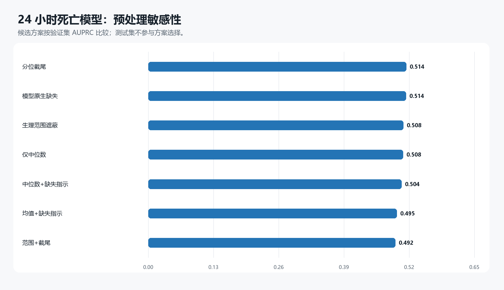
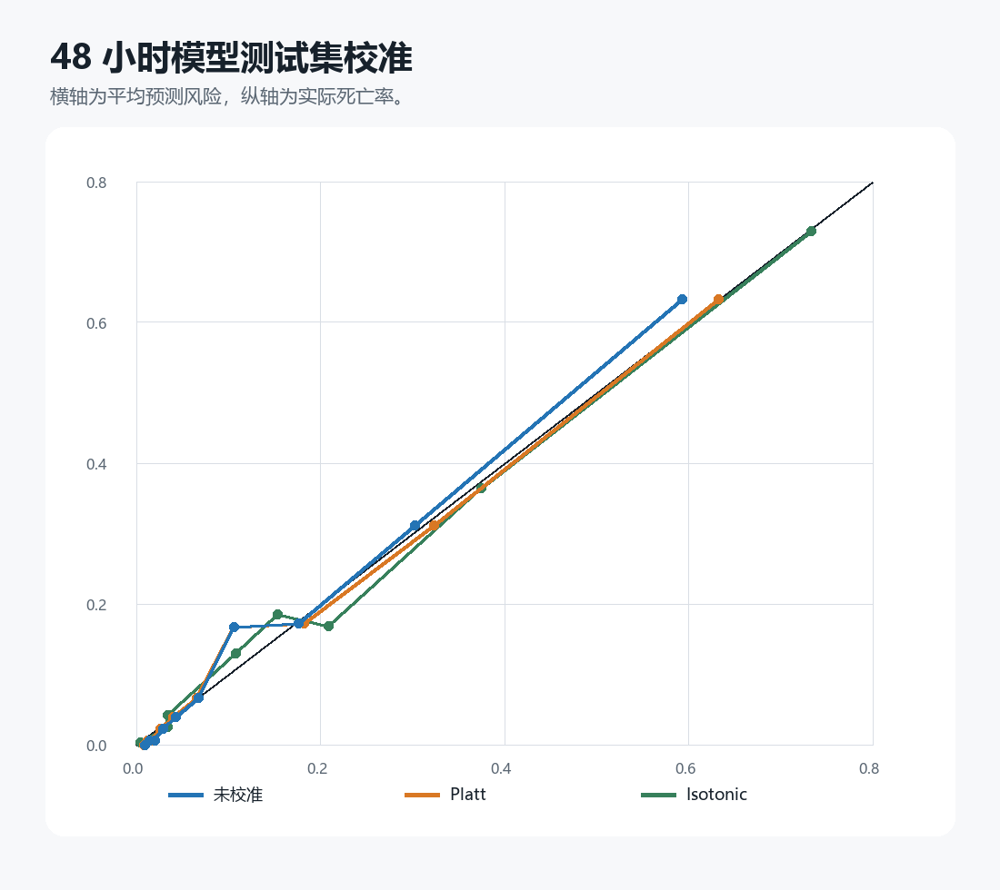
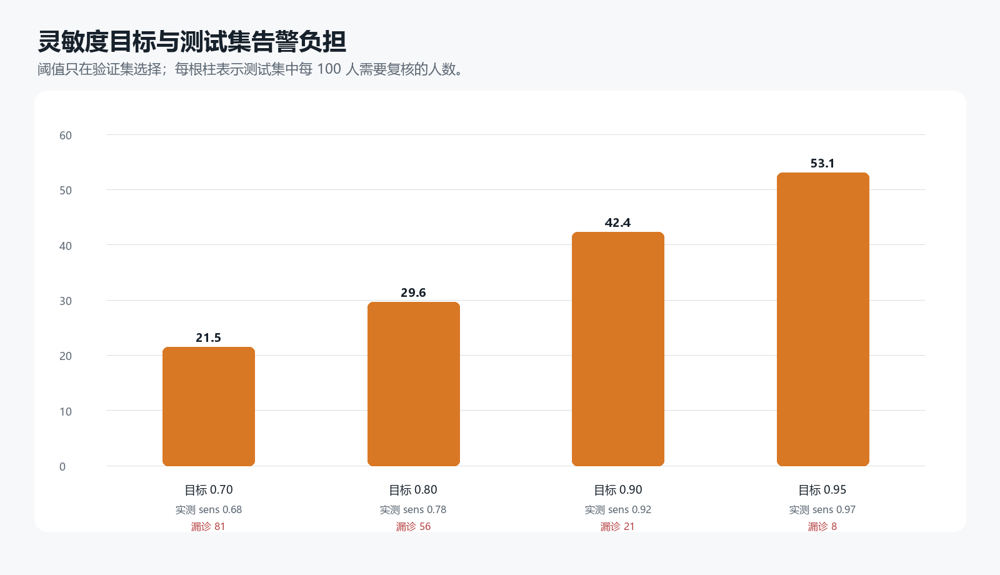

# 实验 06：院内死亡模型稳健性、校准与可迁移性

## 为什么需要这个实验

实验 02 已经给出多时间窗死亡预测基线，但最高 AUROC 并不能回答模型对缺失填补和异常处理是否敏感，也不能直接决定临床阈值。本实验固定患者划分、特征定义和梯度提升参数，先在 24 小时验证集比较预处理方案，再把选定方案扩展到 48 小时，并补充缺失模式、校准、告警负担、亚组、跨 ICU 类型和标签质量分析。

## 预处理敏感性

训练集五折交叉验证结果如下。选择采用一标准误规则：先找到平均 AUPRC 最高的方案，再把与它相差不超过该方案一个标准误的候选视为性能无法明确区分，按照预先排列的简单方案顺序选择。

| 方案 | CV AUPRC均值 | CV AUPRC标准差 | CV Brier均值 |
|---|---|---|---|
| median_indicator | 0.471 | 0.026 | 0.096 |
| median_only | 0.470 | 0.025 | 0.096 |
| physiologic_median_indicator | 0.465 | 0.027 | 0.096 |
| winsor_median_indicator | 0.462 | 0.031 | 0.097 |
| mean_indicator | 0.461 | 0.027 | 0.097 |
| physiologic_winsor_indicator | 0.461 | 0.027 | 0.097 |
| native_missing | 0.456 | 0.019 | 0.097 |

| 方案 | 时间窗 | AUROC | AUPRC | Brier |
|---|---|---|---|---|
| median_indicator | 24 | 0.856 | 0.520 | 0.092 |
| median_only | 24 | 0.856 | 0.524 | 0.092 |
| mean_indicator | 24 | 0.855 | 0.517 | 0.092 |
| native_missing | 24 | 0.854 | 0.507 | 0.093 |
| winsor_median_indicator | 24 | 0.853 | 0.510 | 0.093 |
| physiologic_median_indicator | 24 | 0.854 | 0.510 | 0.093 |
| physiologic_winsor_indicator | 24 | 0.855 | 0.518 | 0.092 |

选中方案为 `median_indicator`。七种方案在 24 小时测试集上的 AUPRC 范围仅为 0.507—0.524，差异没有形成稳定的复杂度收益，因此不进入 KNN 或迭代填补。医学范围方案仅遮蔽报告中已经审计过的明显技术异常，对缓存中的首次值、末次值、最小值、最大值和均值进行特征级敏感性处理，不能替代回到原始逐条记录重新计算摘要。

## 缺失模式消融

| 特征 | 时间窗 | AUROC | AUPRC | Brier |
|---|---|---|---|---|
| presence_only | 24 | 0.704 | 0.244 | 0.115 |
| presence_plus_counts | 24 | 0.720 | 0.276 | 0.113 |
| presence_only | 48 | 0.698 | 0.242 | 0.116 |
| presence_plus_counts | 48 | 0.742 | 0.311 | 0.111 |

这里只使用项目是否被测量、静态字段是否缺失，并在第二组加入测量次数，不使用任何实际生理数值。结果衡量诊疗流程本身能提供多少预测信息，不能解释为缺失导致死亡。

## 校准与工作点

| 方法 | AUROC | AUPRC | Brier | 校准截距 | 校准斜率 |
|---|---|---|---|---|---|
| uncalibrated | 0.882 | 0.592 | 0.084 | 0.209 | 1.106 |
| platt | 0.882 | 0.592 | 0.084 | 0.045 | 1.030 |
| isotonic | 0.880 | 0.557 | 0.084 | -0.138 | 0.876 |

| 验证集目标灵敏度 | 测试集灵敏度 | 特异度 | PPV | 每100人告警 | 漏诊死亡 |
|---|---|---|---|---|---|
| 0.70 | 0.68 | 0.86 | 0.45 | 21.50 | 81 |
| 0.80 | 0.78 | 0.78 | 0.38 | 29.61 | 56 |
| 0.90 | 0.92 | 0.66 | 0.31 | 42.39 | 21 |
| 0.95 | 0.97 | 0.54 | 0.26 | 53.11 | 8 |

最终未校准模型的患者记录级 Bootstrap 区间如下：

| 指标 | 点估计 | 95% CI下限 | 95% CI上限 |
|---|---|---|---|
| auroc | 0.882 | 0.861 | 0.901 |
| auprc | 0.592 | 0.529 | 0.654 |
| brier | 0.084 | 0.076 | 0.093 |

## 亚组、病区和标签敏感性

| 亚组 | n | 死亡率 | AUROC | AUPRC | Brier |
|---|---|---|---|---|---|
| ICUType_1 | 277 | 0.173 | 0.857 | 0.564 | 0.107 |
| ICUType_2 | 372 | 0.027 | 0.959 | 0.286 | 0.023 |
| ICUType_3 | 627 | 0.193 | 0.838 | 0.621 | 0.112 |
| ICUType_4 | 524 | 0.147 | 0.890 | 0.638 | 0.083 |
| age_<65 | 796 | 0.088 | 0.918 | 0.612 | 0.051 |
| age_65_79 | 595 | 0.151 | 0.852 | 0.537 | 0.098 |
| age_80+ | 409 | 0.235 | 0.837 | 0.634 | 0.130 |
| female | 772 | 0.149 | 0.867 | 0.572 | 0.091 |
| male | 1025 | 0.138 | 0.894 | 0.618 | 0.080 |

跨 ICU 类型内部压力测试在三类 ICU 训练、第四类 ICU 评价，并移除 ICU 类型特征：

| 留出ICU | n | 实际死亡率 | 平均预测风险 | AUROC | AUPRC |
|---|---|---|---|---|---|
| 1 | 1769 | 0.127 | 0.134 | 0.848 | 0.512 |
| 2 | 2530 | 0.049 | 0.095 | 0.882 | 0.434 |
| 3 | 4293 | 0.198 | 0.156 | 0.815 | 0.550 |
| 4 | 3408 | 0.149 | 0.122 | 0.857 | 0.554 |

| 分析 | n | AUROC | AUPRC | Brier |
|---|---|---|---|---|
| official_all | 1800 | 0.882 | 0.592 | 0.084 |
| official_model_hard_valid_test | 1790 | 0.879 | 0.570 | 0.083 |
| retrained_without_hard_invalid | 1790 | 0.875 | 0.557 | 0.085 |

只保留死亡时间与住院结束相差不超过不同阈值的死亡记录、同时保留所有硬规则有效的存活记录，冻结模型后的结果如下：

| 最大差值（天） | n | 死亡率 | AUROC | AUPRC |
|---|---|---|---|---|
| 2 | 1734 | 0.110 | 0.882 | 0.527 |
| 5 | 1763 | 0.124 | 0.879 | 0.547 |
| 10 | 1777 | 0.131 | 0.876 | 0.554 |
| all | 1790 | 0.137 | 0.879 | 0.570 |

亚组差异是探索性结果；跨 ICU 类型测试仍来自同一数据集，只能称为内部可迁移性压力测试。标签敏感性把 `Survival=-23/0/1` 或 `Length_of_stay=0/1` 的 95 条硬性异常排除后重新训练和评价，用来检查少量明显错误是否推动总体结果，不用于擅自改写官方主标签。

## 解释边界

本实验没有把 KNN 和迭代填补放入首轮比较：在 12,000×341 的高缺失矩阵上，它们成本更高，也可能生成缺少临床约束的变量组合；只有当简单方案表现不稳定时才值得进入第二轮。校准方法使用验证集拟合，所以校准后的验证集本身不作性能结论，测试集结果仍是内部确认。当前固定测试集此前已经用于基线报告，因此应称为基线后重新锁定的确认集，而不是研究全过程中从未查看的盲测集。
