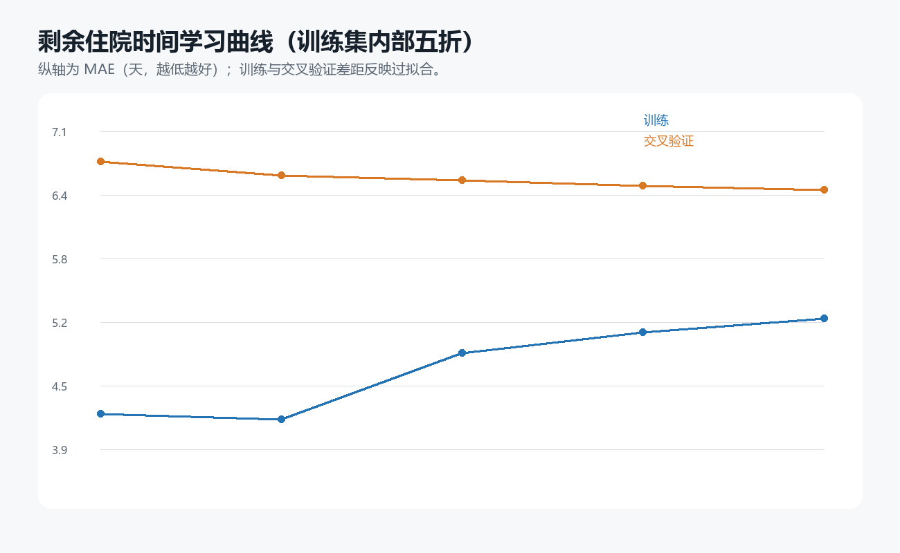
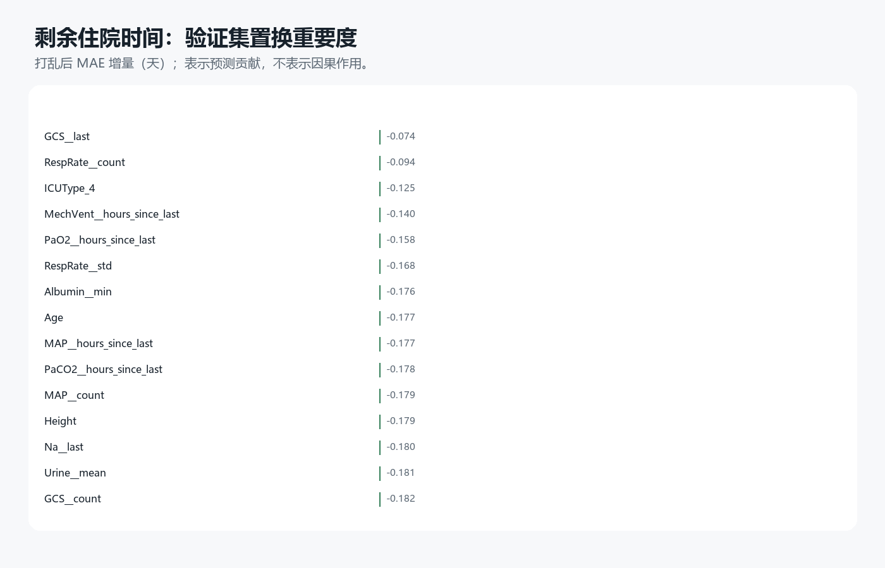
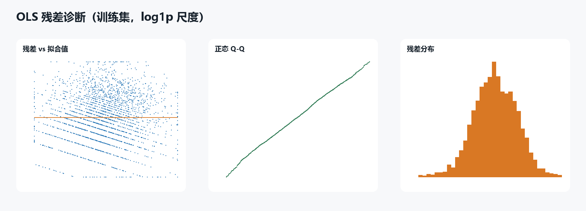

# 实验 06：48 小时后的剩余住院时间

## 研究问题

实验 04 预测从 ICU 入院开始计算的总住院时长；在 48 小时预测时点，这个目标包含了患者已经住满两天这一已知事实。本实验改为 `剩余住院时间=Length_of_stay-2`，只纳入住院时长有效且至少为 2 天的 11,828 次住院。目标仍是医院住院结束时间，不是 ICU 停留时间，也不是康复所需时间。

数据沿用按住院时长十分位划分的 70%/15%/15% 训练、验证和测试结构。中位数填补、缺失指示、标准化和 0.5%—99.5% 分位截尾只从训练数据学习。岭回归、Lasso、直方图梯度提升和随机森林都拟合 `log(1+剩余天数)`；超参数只按验证集直接反变换后的 MAE 选择。

## 候选模型

| 模型 | 参数 | 验证 MAE | 验证 RMSE | 验证 R² | 验证总床日偏差% |
|---|---|---|---|---|---|
| hist_gradient_boosting | 1.000 | 6.374 | 11.557 | 0.110 | -24.946 |
| random_forest | 5.000 | 6.446 | 11.783 | 0.075 | -26.322 |
| random_forest | 15.000 | 6.457 | 11.799 | 0.073 | -26.369 |
| ridge | 1000.000 | 6.510 | 11.685 | 0.090 | -24.604 |
| lasso | 0.001 | 6.514 | 11.678 | 0.091 | -24.342 |
| lasso | 0.010 | 6.526 | 11.741 | 0.082 | -25.859 |
| ridge | 100.000 | 6.527 | 11.668 | 0.093 | -23.971 |
| ridge | 10.000 | 6.554 | 11.680 | 0.091 | -23.650 |
| ridge | 1.000 | 6.564 | 11.688 | 0.090 | -23.543 |
| lasso | 0.050 | 6.770 | 12.103 | 0.024 | -28.468 |
| lasso | 0.100 | 7.029 | 12.437 | -0.030 | -29.786 |
| training_median | 0.000 | 7.338 | 12.756 | -0.084 | -30.744 |

个体预测按验证集直接反变换 MAE 选中 `hist_gradient_boosting`，参数为 1；队列床日按验证集 smearing 后总量绝对偏差另选中 `ridge`，参数为 1。模型间差异需要结合 Bootstrap 区间理解，不能只按小数点后的最低 MAE 宣称一种算法稳定优于另一种算法。

## 两种读数

| 读数 | MAE | 中位绝对误差 | RMSE | R² | 总床日偏差% |
|---|---|---|---|---|---|
| individual_direct | 6.624 | 3.670 | 12.366 | 0.096 | -24.539 |
| cohort_smeared | 7.225 | 4.708 | 12.251 | 0.113 | -0.770 |

个体读数使用验证集 MAE 最低模型的直接反变换；队列读数使用验证集总床日偏差最小模型的 Duan smearing 校正。后者使用训练残差估计乘法因子，更接近条件均值。两者的模型和选择标准都不同，不应把总量校准较好解释成个体出院日期已经准确。

最终直接读数的患者记录级 Bootstrap 区间：

| 读数 | 指标 | 点估计 | 95% CI下限 | 95% CI上限 |
|---|---|---|---|---|
| individual_direct | mae_days | 6.624 | 6.124 | 7.157 |
| individual_direct | rmse_days | 12.366 | 10.539 | 14.310 |
| individual_direct | sum_bias_percent | -24.539 | -28.101 | -20.582 |
| cohort_smeared | mae_days | 7.225 | 6.775 | 7.656 |
| cohort_smeared | rmse_days | 12.251 | 10.508 | 13.937 |
| cohort_smeared | sum_bias_percent | -0.770 | -5.374 | 4.818 |

## 亚组与边界

| 读数 | 亚组 | n | MAE | 实际总床日 | 预测总床日 | 总床日偏差% |
|---|---|---|---|---|---|---|
| individual_direct | survived_to_discharge | 1545 | 6.46 | 18209.00 | 13331.50 | -26.79 |
| individual_direct | in_hospital_death | 230 | 7.72 | 2588.00 | 2362.18 | -8.73 |
| individual_direct | long_stay_total_LOS_25+ | 227 | 25.05 | 8434.00 | 2747.43 | -67.42 |
| individual_direct | ICUType_1 | 245 | 4.90 | 2165.00 | 1718.56 | -20.62 |
| individual_direct | ICUType_2 | 388 | 4.74 | 3838.00 | 3228.42 | -15.88 |
| individual_direct | ICUType_3 | 647 | 7.12 | 7609.00 | 5684.39 | -25.29 |
| individual_direct | ICUType_4 | 495 | 8.30 | 7185.00 | 5062.30 | -29.54 |
| cohort_smeared | survived_to_discharge | 1545 | 6.91 | 18209.00 | 17414.50 | -4.36 |
| cohort_smeared | in_hospital_death | 230 | 9.32 | 2588.00 | 3222.45 | 24.52 |
| cohort_smeared | long_stay_total_LOS_25+ | 227 | 21.26 | 8434.00 | 3649.63 | -56.73 |
| cohort_smeared | ICUType_1 | 245 | 5.33 | 2165.00 | 2224.75 | 2.76 |
| cohort_smeared | ICUType_2 | 388 | 5.61 | 3838.00 | 4332.85 | 12.89 |
| cohort_smeared | ICUType_3 | 647 | 7.72 | 7609.00 | 7254.62 | -4.66 |
| cohort_smeared | ICUType_4 | 495 | 8.78 | 7185.00 | 6824.73 | -5.01 |

死亡会提前结束住院，长住院患者又形成右侧长尾，因此总体均值可能掩盖重要亚组误差。队列总床日接近真实值也可能来自不同 ICU 的正负误差抵消。当前结果只用于内部方法比较；没有医院和日期字段，无法进行跨医院或时间外容量验证，不能用于承诺个人出院日期。

## 课程对齐补充：从 OLS 到调优后的非线性模型

为了让实验路径更符合“简单方法—复杂方法—调优”的通常顺序，补充分析先用 18 个预先指定的代表性变量拟合 OLS，再比较带正则化的岭回归与梯度提升，最后只在训练集五折中搜索超参数。OLS 在 `log(1+剩余天数)` 尺度的 R²/调整 R² 为 0.119/0.117，Durbin–Watson 为 1.998，条件数为 3.45；测试集反变换后的 MAE 为 7.16 天、R² 为 0.002。系数、标准误、p 值和 95% 置信区间用于理解线性关联，但由于观测数据、变量筛选和模型假设限制，不作因果解释。

五折搜索在验证集选择学习率 0.03、31 个最大叶节点和 L2=1 的梯度提升，验证 MAE 为 6.58 天；合并训练集与验证集后，其测试 MAE 为 6.67 天，未优于原实验的 6.62 天。学习曲线的五折 MAE 在样本量增加后约停在 6.48 天，而训练 MAE 约为 5.20 天，提示继续扩大参数网格的收益有限，模型仍有一定泛化差距。因而补充调优用于展示规范方法和检查稳健性，不替代原先已经锁定的主结果。

