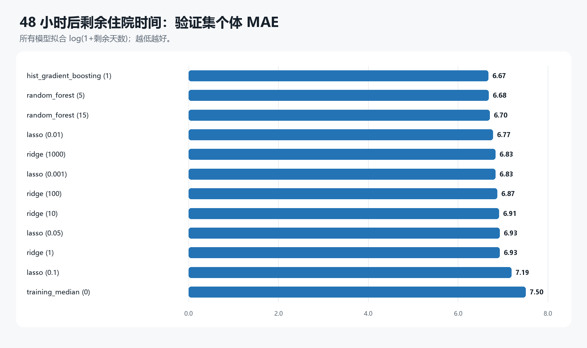
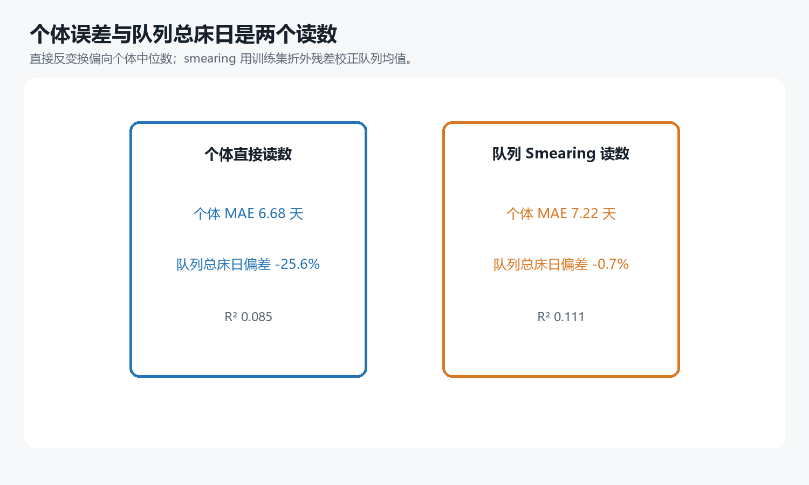

# 实验 06：48 小时后的剩余住院时间

## 研究问题

实验 04 预测从 ICU 入院开始计算的总住院时长；在 48 小时预测时点，这个目标包含了患者已经住满两天这一已知事实。本实验改为 `剩余住院时间=Length_of_stay-2`，只纳入住院时长有效且至少为 2 天的 11,828 次住院。目标仍是医院住院结束时间，不是 ICU 停留时间，也不是康复所需时间。

数据沿用按住院时长十分位划分的 70%/15%/15% 训练、验证和测试结构。中位数填补、缺失指示、标准化和 0.5%—99.5% 分位截尾只从训练数据学习；截尾仅作用于连续生理数值，不改变性别、ICU one-hot、测量次数或距末次测量时间。岭回归、Lasso、直方图梯度提升和随机森林都拟合 `log(1+剩余天数)`；超参数只按验证集直接反变换后的 MAE 选择。

## 候选模型

| 模型 | 参数 | 验证 MAE | 验证 RMSE | 验证 R² | 验证总床日偏差% |
|---|---|---|---|---|---|
| hist_gradient_boosting | 1.000 | 6.675 | 12.836 | 0.063 | -26.375 |
| random_forest | 5.000 | 6.678 | 12.872 | 0.058 | -27.298 |
| random_forest | 15.000 | 6.700 | 12.870 | 0.058 | -27.511 |
| lasso | 0.010 | 6.773 | 12.859 | 0.060 | -26.337 |
| ridge | 1000.000 | 6.829 | 12.826 | 0.065 | -24.687 |
| lasso | 0.001 | 6.833 | 12.814 | 0.067 | -24.078 |
| ridge | 100.000 | 6.866 | 12.825 | 0.065 | -23.619 |
| ridge | 10.000 | 6.912 | 12.854 | 0.061 | -23.025 |
| lasso | 0.050 | 6.927 | 13.138 | 0.019 | -29.443 |
| ridge | 1.000 | 6.928 | 12.858 | 0.060 | -22.829 |
| lasso | 0.100 | 7.187 | 13.434 | -0.026 | -30.986 |
| training_median | 0.000 | 7.502 | 13.768 | -0.078 | -31.582 |

个体预测按验证集直接反变换 MAE 选中 `hist_gradient_boosting`，参数为 1；队列床日按验证集 smearing 后总量绝对偏差另选中 `ridge`，参数为 1000。模型间差异需要结合 Bootstrap 区间理解，不能只按小数点后的最低 MAE 宣称一种算法稳定优于另一种算法。

## 两种读数

| 读数 | MAE | 中位绝对误差 | RMSE | R² | 总床日偏差% |
|---|---|---|---|---|---|
| individual_direct | 6.680 | 3.755 | 12.271 | 0.085 | -25.600 |
| cohort_smeared | 7.224 | 4.692 | 12.096 | 0.111 | -0.707 |

个体读数使用验证集 MAE 最低模型的直接反变换；队列读数使用验证集总床日偏差最小模型的 Duan smearing 校正。后者使用训练集五折的折外残差估计乘法因子，避免树模型因训练残差过小而系统性低估校正幅度。两者的模型和选择标准都不同，不应把总量校准较好解释成个体出院日期已经准确。

最终直接读数的患者记录级 Bootstrap 区间：

| 读数 | 指标 | 点估计 | 95% CI下限 | 95% CI上限 |
|---|---|---|---|---|
| individual_direct | mae_days | 6.680 | 6.184 | 7.170 |
| individual_direct | rmse_days | 12.271 | 10.555 | 14.048 |
| individual_direct | sum_bias_percent | -25.600 | -28.867 | -21.753 |
| cohort_smeared | mae_days | 7.224 | 6.792 | 7.685 |
| cohort_smeared | rmse_days | 12.096 | 10.512 | 13.857 |
| cohort_smeared | sum_bias_percent | -0.707 | -5.467 | 3.969 |

## 亚组与边界

| 读数 | 亚组 | n | MAE | 实际总床日 | 预测总床日 | 总床日偏差% |
|---|---|---|---|---|---|---|
| individual_direct | survived_to_discharge | 1514 | 6.35 | 17809.00 | 12753.60 | -28.39 |
| individual_direct | in_hospital_death | 261 | 8.57 | 3019.00 | 2742.42 | -9.16 |
| individual_direct | long_stay_total_LOS_25+ | 223 | 25.70 | 8348.00 | 2616.99 | -68.65 |
| individual_direct | ICUType_1 | 243 | 5.61 | 2402.00 | 1690.51 | -29.62 |
| individual_direct | ICUType_2 | 406 | 5.00 | 4072.00 | 3310.97 | -18.69 |
| individual_direct | ICUType_3 | 664 | 7.79 | 8315.00 | 5633.24 | -32.25 |
| individual_direct | ICUType_4 | 462 | 7.13 | 6039.00 | 4861.29 | -19.50 |
| cohort_smeared | survived_to_discharge | 1514 | 6.71 | 17809.00 | 16867.90 | -5.28 |
| cohort_smeared | in_hospital_death | 261 | 10.19 | 3019.00 | 3812.94 | 26.30 |
| cohort_smeared | long_stay_total_LOS_25+ | 223 | 22.23 | 8348.00 | 3423.26 | -58.99 |
| cohort_smeared | ICUType_1 | 243 | 5.71 | 2402.00 | 2241.76 | -6.67 |
| cohort_smeared | ICUType_2 | 406 | 5.51 | 4072.00 | 4428.79 | 8.76 |
| cohort_smeared | ICUType_3 | 664 | 8.24 | 8315.00 | 7461.56 | -10.26 |
| cohort_smeared | ICUType_4 | 462 | 8.07 | 6039.00 | 6548.72 | 8.44 |

死亡会提前结束住院，长住院患者又形成右侧长尾，因此总体均值可能掩盖重要亚组误差。队列总床日接近真实值也可能来自不同 ICU 的正负误差抵消。当前结果只用于内部方法比较；没有医院和日期字段，无法进行跨医院或时间外容量验证，不能用于承诺个人出院日期。
