# ICU 前 48 小时临床数据：探索性分析、死亡预测、住院时长回归与患者分型

**报告版本：** 2026-09-07

**研究状态：** 已完成全量 12,000 次 ICU 住院记录的数据审计、探索性分析、多时间窗院内死亡预测、预处理与标签稳健性、校准和内部可迁移性分析，并完成总住院时长、48 小时后剩余住院时间回归及 24 小时患者表型聚类。

**使用边界：** 本项目是回顾性方法研究，尚未进行外部验证、前瞻性验证或临床效用评估，结果不能直接用于临床决策。

## 摘要

本研究使用 PhysioNet/Computing in Cardiology Challenge 2012 所整理的成人 ICU 数据，分析入 ICU 后前 48 小时内不规则采样的生命体征、实验室检查、治疗记录和静态信息，并以院内死亡为主要预测结局。当前本地数据包含 12,000 次 ICU 住院、5,285,818 行原始记录，其中院内死亡 1,707 例，死亡率为 14.225%。数据覆盖 CCU、CSRU、MICU 和 SICU 四类 ICU；患者级文件与结局表之间一一对应，没有重复 RecordID 或无法匹配的记录。

探索性分析显示，这是一组典型的稀疏、不规则且具有临床选择机制的医疗时序数据。心率、体温、GCS、肾功能和血常规等变量覆盖率接近 98%，而 TroponinI、Cholesterol、TroponinT、RespRate 等变量的覆盖率明显较低。这里的缺失并非都可以看作随机缺失：某项检查是否被开立、何时复查以及复查频率，可能同时反映病情、ICU 工作流程与治疗决策。因此，当前基线没有进行简单的全局前向填充或把缺失填为 0，而是同时保留数值统计、测量次数、距末次测量时间和缺失指示，并把填补器置于模型流程中，仅从训练集学习中位数，避免验证集或测试集的信息进入预处理过程。

预测实验采用固定、按死亡结局分层的训练集、验证集和确认集，样本量分别为 8,400、1,800 和 1,800。每个时间窗均构造 341 个输入特征，比较逻辑回归与直方图梯度提升模型，并另设静态信息模型和 SAPS-I/SOFA 参照模型。结果显示，随着观察时间由 6 小时增加到 48 小时，模型判别能力总体提高；48 小时梯度提升模型取得当前最佳结果：AUROC 0.882（95% CI 0.861–0.900）、AUPRC 0.592（0.536–0.651）、Brier 0.084（0.076–0.093）。第二阶段进一步比较七种填补与清洗组合，没有发现比简单中位数方案更稳定的树模型预处理；逻辑回归在部分时间窗有小幅改善，但没有形成跨时间窗一致优势。新增的工作点、再校准和留一 ICU 分析只作为第二阶段的补充，不再单列为一套重复实验。当前仍缺少跨医院、跨时间验证，因此这些结果应视为内部方法学证据。

在独立的连续结局实验中，排除 167 例缺失 LOS 和 5 例与纳入条件矛盾的 LOS<2 天记录后，共纳入 11,828 例。总住院时长基线的测试集 MAE 为 6.68 天（Bootstrap 95% CI 6.17—7.24），R² 为 0.091。进一步把任务改为预测 48 小时后的剩余住院时间后，梯度提升的个体 MAE 为 6.62 天（95% CI 6.12—7.16），但低估总床日 24.5%；另按验证集总量误差选择岭回归并作 smearing 校正后，测试队列总床日偏差为 −0.77%（95% CI −5.37%—4.82%），代价是个体 MAE 增至 7.22 天。长住院和不同 ICU 亚组仍有明显偏差，因此总体床日接近不能解释为个体或病区层面已经准确。

无监督实验使用 24 个 24 小时临床状态特征，经训练集截尾、中位数填补、标准化和 PCA 后比较 k=2–8 的 K-means。按稳定性、最小簇比例和留出集轮廓系数选择 k=4；留出集轮廓系数为 0.119，20 次子样本稳定性 ARI 中位数为 0.980。该结果呈现稳定但重叠明显的粗粒度分组，不能直接解释为四种疾病。簇后死亡率从 8.7% 到 28.3% 不等，但结局未参与建簇，差异只用于描述。

## 一、研究目的与问题定义

当前数据最适合首先回答三个层次的问题。第一层是数据层：各变量的类型、覆盖率、测量频率、异常值和缺失机制是什么，哪些字段可以直接用于机器学习，哪些字段需要特殊解释。第二层是预测层：只使用某一预测时点之前能够获得的信息，是否可以预测患者最终发生院内死亡；随着观察窗从 6 小时延长到 48 小时，性能提高多少。第三层是解释与扩展层：哪些临床状态、变化趋势和测量行为与死亡风险相关，现有基线的不足在哪里，以及下一阶段应怎样开展稳健性、校准、亚组和外部验证实验。

主要监督学习任务被定义为二分类：输入是患者入 ICU 后前 6、12、24 或 48 小时的静态与时序信息，输出是 `In-hospital_death`。标签 1 表示患者在本次住院出院前死亡，标签 0 表示存活出院。另一个已经完成的描述性任务关注 `Length_of_stay`：分别在存活出院和院内死亡组内分析 SAPS-I、SOFA 与住院时长的关系。住院时长在这里指从进入 ICU 到整个住院结束的天数，包含离开 ICU 后继续住院的时间，不能解释成 ICU 停留时长。

## 二、数据来源、队列与字段结构

原始数据来源于 [PhysioNet Challenge 2012 数据集](https://physionet.org/content/challenge-2012/1.0.0/)。官方数据说明指出，队列由成人 ICU 住院记录组成，覆盖冠心病监护、心脏外科恢复、内科和外科 ICU；住院少于 48 小时者被排除，每份患者记录描述入 ICU 后前 48 小时。Challenge 原始发布将 12,000 个病例划分为 A、B、C 三组，而当前本地 `release/` 已将数据合并并重新编号为 100001—112000，且为全部记录提供了结局。因此，本研究可以建立本地内部基线，但不能把当前随机划分的性能与原 Challenge 盲测排行榜直接比较。

数据由两部分构成：`release/outcomes.csv` 提供每次 ICU 住院的 SAPS-I、SOFA、住院时长、生存时间和院内死亡标签；`release/icu_records/<RecordID>.csv` 提供 `Time, Parameter, Value` 三列的长表记录。静态字段包括年龄、性别、身高、ICU 类型和入院体重；动态字段共有 37 个，涵盖生命体征、血压、血气、肝肾功能、电解质、血细胞、尿量和机械通气等。年龄 90 表示 90 岁及以上的隐私保护截断值，不能当作精确年龄。数据集没有患者身份、医院编号或入院日期，因此分析单位严格表述为“ICU 住院记录”；现有字段无法确认不同记录是否属于同一患者，也无法据此完成患者级去重、时间外验证或医院外验证。

### 2.1 文件阅读范围与研究边界

除原始数据、分析代码和既有输出外，工作区根目录还有 8 份课程材料。它们依次讨论医疗 AI 的问题定义与生命周期、EDA 和数据预处理、回归、分类、医疗应用场景、树模型、模型优化以及无监督学习。当前研究流程与这些材料提出的顺序一致：先界定人群、标签和预测时点，再审计缺失与异常，先划分数据后拟合填补与缩放，建立简单基线，最后讨论交叉验证、亚组评价和部署边界。课程材料只作为方法学对照，其中的示例数值没有被复制为本研究结果。

| 工作区材料 | 在本研究中的对应内容 |
|---|---|
| `01 Introduction to AI in Healthcare.pdf` | 医疗场景的问题定义、风险与完整生命周期 |
| `02 Exploratory Data Analysis.pdf` | EDA、缺失机制、患者级/分层划分、泄漏防控与预处理 |
| `03 Regression Models.pdf` | 住院时长、偏态结局、相关性与回归扩展方案 |
| `04 Classification Models.pdf` | 院内死亡分类、混淆矩阵、AUROC/AUPRC、灵敏度与特异度 |
| `05 Healthcare AI Use Cases.pdf` | 预测时点、临床工作流、行动者与评价目标 |
| `06 Tree-based Models.pdf` | 梯度提升基线、正则化、早停与解释边界 |
| `07 Model Optimization.pdf` | 交叉验证、超参数优化、测试集隔离与不平衡评价 |
| `08 Unsupervised Learning.pdf` | 患者表型聚类、降维、稳定性和外部验证要求 |

全量完整性检查结果如下：12,000 个患者文件与 12,000 行结局完整一一匹配，结局表无重复 ID，`In-hospital_death` 无缺失。原始患者文件共有 5,285,818 行；每次住院的原始记录行数中位数约为 429.5，动态有效观测数中位数约为 391，时间点数中位数约为 72。四类 ICU 的样本构成和未经调整的死亡率存在明显差异。

| ICU 类型 | 样本数 | 院内死亡数 | 死亡率 |
|---|---:|---:|---:|
| CCU（冠心病监护） | 1,769 | 224 | 12.66% |
| CSRU（心外科恢复） | 2,530 | 123 | 4.86% |
| MICU（内科 ICU） | 4,293 | 852 | 19.85% |
| SICU（外科 ICU） | 3,408 | 508 | 14.91% |
| 合计 | 12,000 | 1,707 | 14.225% |

这些差异提示 ICU 类型既是合理的预测变量，也是潜在的病例组合和工作流程代理变量。模型获得的性能可能部分来自不同 ICU 人群构成，而不完全来自个体生理状态，因此后续必须进行 ICU 类型分层评估。

## 三、探索性数据分析

### 3.1 标签、结局与静态变量

院内死亡标签呈中度不平衡：存活出院 10,293 例，占 85.775%；院内死亡 1,707 例，占 14.225%。如果一个无效分类器把所有病例都判断为存活，其表面准确率也会达到 85.8%，所以准确率不适合作为本研究的主要指标。后续同时报告 AUROC、AUPRC、Brier 分数、灵敏度、特异度、精确率和 F1，并把 14.225% 作为理解 AUPRC 和阳性预测值的背景基线。


SAPS-I 缺失 518 例（4.32%），有效值中位数 15、均值 15、最大值 38；SOFA 缺失 403 例（3.36%），有效值中位数 7、均值 6.66、最大值 22。`Length_of_stay` 缺失 167 例（1.39%），有效记录中位数 10 天、均值 13.62 天、第 95 百分位 36 天、最大值 295 天，分布明显右偏。`Survival=-1` 有 7,410 例，它表示没有记录到死亡时间，不应与普通测量缺失混为一谈。

结局表共有 95 个唯一记录明确违反官方约束。这不是部分举例，而是当前规则下的全量计数：91 条 `Survival` 为 0 或 1，5 条 `Length_of_stay` 为 0 或 1，1 条 `Survival=-23`，各类之间存在重叠；进一步按标签核对，有 85 条死亡标签记录不满足 `2 ≤ Survival ≤ Length_of_stay`，3 条存活标签记录不满足 `Survival=-1` 或 `Survival>Length_of_stay`。这些属于可以根据数据字典直接识别的硬性异常。

另一类问题是“死亡时间远短于住院时长”。1,707 条院内死亡记录中，有 1,622 条满足官方标签规则；在这 1,622 条中，`Length_of_stay−Survival` 超过 2、5、10 和 30 天的分别有 383、183、83 和 10 条，最大差值为 105 天。官方定义只要求死亡时间不晚于住院结束，因此这些大差值在形式上仍然有效，但从临床日期或行政记录的一致性看值得怀疑。报告不会把它们与 95 条硬性异常混为一类，也不会在没有原始日期来源时擅自改写。

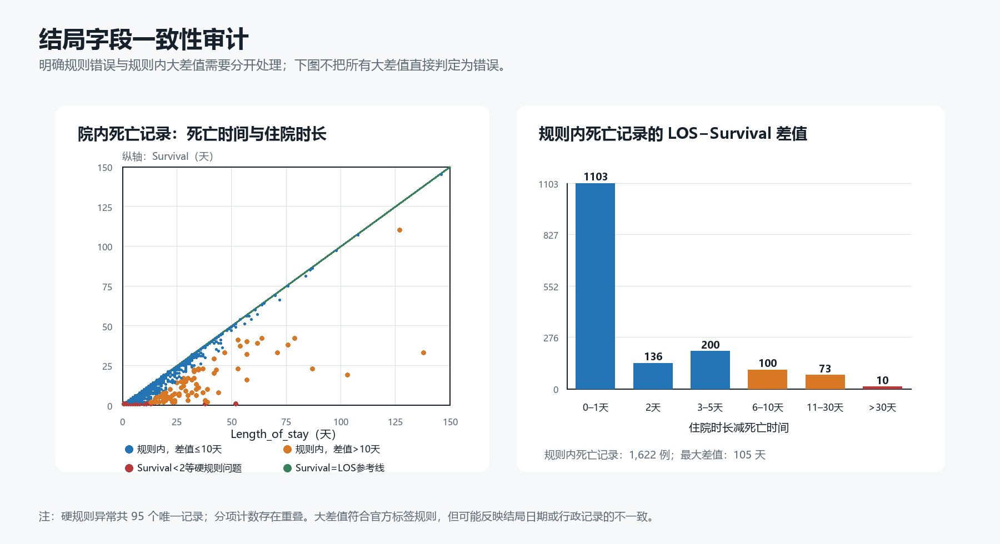

静态变量中，年龄完整，中位数 67 岁，范围 15—90 岁，其中 464 例记录为 90，代表 90 岁及以上。性别有效 11,988 例，女性 5,261 例、男性 6,727 例、缺失 12 例。身高只有 6,274 例有效，缺失率 47.72%，且最小值 1.8、最大值 462.3，存在明显单位或录入异常；入院体重有效 10,999 例，缺失率 8.34%，中位数 78 kg，范围 6—472 kg。因为缺少能够确认单位转换与临床边界的原始元数据，当前基线没有主观改写这些极值，这一选择会被纳入后续敏感性分析。

### 3.2 时序变量覆盖率与不规则采样

时序变量的覆盖率差别很大。BUN、肌酐、心率、体温、GCS、红细胞压积和血小板等变量在约 98% 的住院中至少出现一次；TroponinI 只有 4.71%，Cholesterol 为 7.90%，TroponinT 为 21.98%。即使覆盖率相近，变量的测量频率也不同：心率的患者内观测次数中位数为 55，尿量为 38，而白蛋白、胆红素、肝酶等常常只有一次。把这些长表直接展开为固定宽度矩阵会产生大量缺失，也会丢失测量间隔和复查频率所包含的信息。


观察窗越长，可用信息越多。每次住院的有效动态观测数中位数从前 6 小时的 60 条增加到前 12 小时的 114 条、前 24 小时的 213 条和前 48 小时的 391 条。以常见变量为例，心率覆盖率由 6 小时的 96.02% 增至 48 小时的 98.47%；GCS 由 92.31% 增至 98.46%；BUN 和肌酐则由约 65.8% 增至 98.48%。相反，TroponinI 在 48 小时内仍只有 4.71% 的覆盖率。这种结构解释了为什么延长观察窗可能提高模型性能，同时也提醒我们：48 小时模型是在更晚时间点作出预测，临床提前量少于 6 小时模型，不能只按 AUROC 高低决定哪个模型更有价值。

### 3.3 死亡组与存活组的描述性差异

对每位患者先计算其前 48 小时变量均值，再比较死亡组与存活组，绝对标准化均值差较大的变量包括 GCS、BUN、乳酸、胆红素、尿量、呼吸频率、HCO3 和白蛋白。死亡组的 GCS、尿量、HCO3 和白蛋白总体较低，BUN、乳酸、胆红素和呼吸频率总体较高。这些方向与重症患者的意识状态、器官灌注、酸碱平衡和肝肾功能异常相符，但当前结果未经年龄、ICU 类型、治疗或检查选择调整，只能用于描述和产生假设。

| 变量 | 存活组患者均值的中位数 | 死亡组患者均值的中位数 | SMD（死亡−存活） | 覆盖率差（死亡−存活） |
|---|---:|---:|---:|---:|
| GCS | 12.91 | 9.13 | -0.852 | -0.05% |
| BUN | 17.75 | 28.00 | +0.619 | +1.37% |
| Lactate | 1.84 | 2.22 | +0.529 | +19.09% |
| Bilirubin | 0.70 | 0.90 | +0.490 | +19.08% |
| Urine | 117.97 | 74.99 | -0.445 | -0.88% |
| RespRate | 18.92 | 20.87 | +0.419 | -14.85% |
| HCO3 | 24.00 | 22.00 | -0.417 | +1.53% |
| Albumin | 3.00 | 2.73 | -0.382 | +17.22% |


乳酸、胆红素、白蛋白和 ALP 在死亡组的覆盖率高出约 17%—19%，而 RespRate 在死亡组的覆盖率反而更低约 14.85%。这说明“是否测量”与结局有关，缺失机制很可能不是完全随机缺失（MCAR）。它可能接近条件随机缺失（MAR），也可能含有无法由已观测变量充分解释的非随机缺失（MNAR）。由于仅靠该数据无法识别真实缺失机制，本报告不把某一种机制当作已证实结论，而是在建模中保留缺失模式，并计划通过消融实验检验模型依赖缺失信息的程度。

### 3.4 评分、住院时长与相关性

SAPS-I 与 SOFA 之间具有中等偏强相关，Pearson 相关系数为 0.681，Spearman 相关系数为 0.689，说明二者测量了相互重叠但不完全相同的严重程度。SAPS-I 与院内死亡的点二列相关约为 0.205，SOFA 与院内死亡约为 0.193；这类相关系数不能完整代表非线性判别能力，因此评分模型仍应通过 AUROC、AUPRC 和校准进行评价。

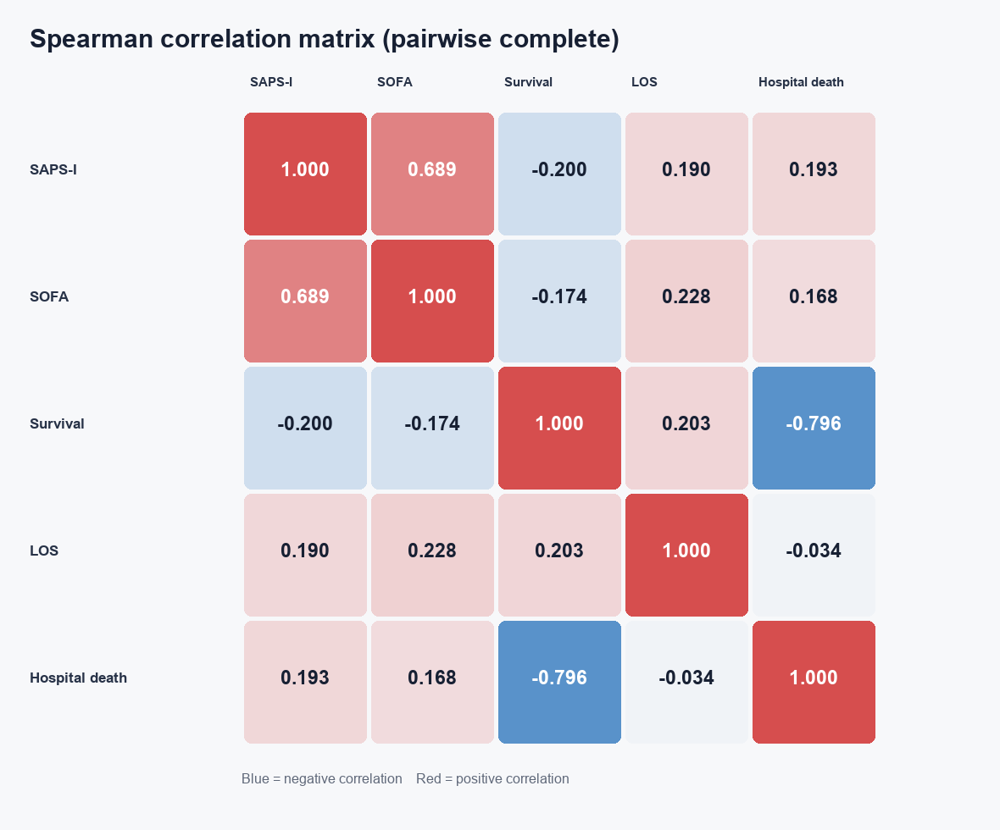

住院时长实验在排除 167 条缺失和 5 条小于 2 天的异常记录后进行。存活出院组 10,122 例，住院时长中位数为 10 天；院内死亡组 1,706 例，中位数为 9.5 天。存活组中 SAPS-I 与住院时长的 Spearman 相关为 0.245，SOFA 为 0.272，属于弱正相关；死亡组对应相关分别为 -0.056 和 0.043，接近于无单调关系。住院时长同时受到疾病严重度、恢复、并发症、转院与死亡这一竞争事件影响，因此不能简单地把它当作严重程度的线性结果。

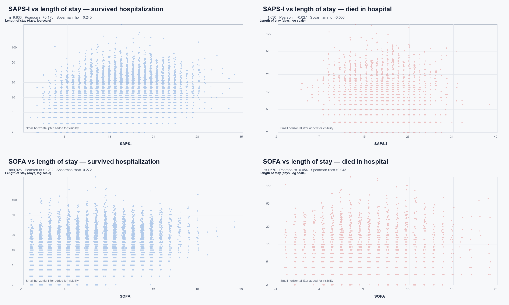

## 四、数据质量问题与处理原则

### 4.1 缺失值的三种语义

本数据至少存在三种不同的“缺失”。第一种是显式哨兵值：患者文件中 `Value=-1` 表示测量缺失，本次全量读取共识别 6,963 行并转为缺失；SAPS-I、SOFA 和住院时长中的 `-1` 同样按各字段说明处理。第二种是结构性缺失，即某个患者从未接受某项检查，或者在预测时间窗内还没有测量；这类缺失保留为 `NaN`，并附加缺失指示和测量行为特征。第三种是特殊结局编码：`Survival=-1` 表示未记录到死亡，而不是一般的数据缺失。三者若用同一种规则处理，会造成临床语义混淆。

机械通气字段尤其需要谨慎。数据中实际出现的有效 `MechVent` 值只有 1，没有可靠的显式 0，因此“没有 MechVent 记录”不能直接重编码为“未机械通气”。当前模型把有记录的 1 作为观测，把未记录作为缺失，同时让缺失指示和测量次数表达记录模式。

### 4.2 空参数、同分钟重复值与时间边界

共有 2,403 行的 `Parameter` 为空，涉及 1,594 个住院文件。例如，部分文件会同时出现 `32:14,Albumin,2.1` 和 `32:14,,2.1`，另一些空行则与前后一小时内的 Albumin 数值相同。这些空行可能是字段名丢失的白蛋白重复记录，但仅凭时间和数值无法确认。为避免错误归类或重复计数，当前分析保留名称明确的 Albumin 记录，排除空参数行，并记录其数量。

同一患者、同一分钟、同一变量存在重复或冲突测量。前 48 小时内需要折叠的额外行数为 11,791，涉及多种血压和其他变量，可能来自不同传感器、设备或重复录入。特征提取先在“患者—时间—变量”层面对数值取中位数，再计算窗口统计，防止某一分钟的多次记录获得不成比例的权重。

虽然文档把前 48 小时写为 00:00—47:59，原始文件仍有 1,412 行时间戳为 48:00，分布于 235 份记录。为了严格定义预测时点，所有窗口均采用左闭右开区间 `0 <= time < cutoff`；因此 6:00、12:00、24:00 和 48:00 时刻的观测分别不进入对应窗口。这一规则同时避免边界不一致和潜在的时间泄漏。

### 4.3 异常值

全量审计发现，身高有效值中有 17 条低于 100 cm、11 条高于 250 cm；体重高于 300 kg 的记录有 1 条。动态数据中，血压非正值共有 4,833 行、涉及 1,269 个患者；体温位于 25—45℃之外的有 298 行，pH 位于 6.5—8.0 之外的有 21 行，心率非正或高于 250 的有 46 行，呼吸频率非正或高于 80 的有 165 行。部分值可能是单位、录入或解析问题，也有部分可能代表设备伪差或极端临床状态。

当前基线只把文档明确规定的 `-1` 处理为缺失，没有按统一分位数截断，也没有凭经验删除生理极值。这样可以让首个结果保持规则简单、可复现，并避免在没有医学审核时误删真实重症观测；代价是模型可能受到异常值影响。逻辑回归在填补后进行了标准化，梯度提升对极端值相对稳健，但这并不能替代数据清洗。下一阶段应分别使用来源可追溯的临床范围、仅由训练集估计的分位数 Winsorization 以及完全不裁剪三套方案，比较性能与校准变化。

### 4.4 结局字段异常怎样影响死亡模型

当前死亡模型只把 `In-hospital_death` 用作标签，`Survival` 和 `Length_of_stay` 都不进入输入，因此二者之间的大差值不会形成直接的特征泄漏。不过，如果死亡标签本身由不可靠的结局日期推导，标签噪声仍可能影响训练和评价。后续实验将保留全体 12,000 例作为与 Challenge 定义一致的主分析，同时增加两类敏感性结果：一类排除 95 条硬规则异常；另一类按 `Length_of_stay−Survival` 的差值分层评价，但不直接把大差值病例删除或改标签。这样可以观察结论是否依赖这些可疑记录。

## 五、缺失数据填补方案

本研究没有对原始文件进行改写，填补只发生在模型训练管道内。首先，在患者级特征生成阶段，每个变量如果没有有效数值，`first`、`last`、`min`、`max`、`mean`、`std`、`slope` 和 `hours_since_last` 保留为缺失，测量时间点数记为 0。这样，模型可以区分“有值且较低”和“根本没有测量”。其次，数据划分完成后，`SimpleImputer(strategy="median", add_indicator=True, keep_empty_features=True)` 只在训练集拟合；每一列使用训练集的中位数填补，并为出现过缺失的特征增加指示变量，完全无观测的列仍予以保留以维持特征结构。最后，验证集和测试集只调用已经拟合的转换规则，不重新计算中位数。

选择中位数是因为许多实验室指标和住院内汇总值偏态明显，中位数对极端值比均值稳健。添加缺失指示是为了让模型利用“该项检查是否被测量”的信息，但它也可能捕捉某家医院或 ICU 的工作流程，而不是稳定的生理机制。为降低这种风险，报告不把缺失指示产生的预测增益解释成临床因果关系，后续将单独做缺失特征消融与跨 ICU 验证。

当前没有使用患者内线性插值、前向填充或后向填充。原因是变量采样极不规则，且某些实验室指标一天只测一次；大范围前向填充会人为制造长时间稳定的轨迹，后向填充还可能把预测时点之后的结果带回过去。若后续采用逐小时序列模型，应使用带时间间隔和掩码的插值策略，并保证任何插值只利用预测时点之前的信息。

## 六、特征工程与信息泄漏控制

每个时间窗的特征由 37 个时序变量和静态信息构成。对每个时序变量，在同分钟重复值取中位数后计算 9 项统计：首次值、末次值、最小值、最大值、均值、总体标准差、不同有效时间点数、按小时计算的线性斜率，以及预测时点距末次测量的小时数。37×9 共 333 项。静态数值变量包括年龄、性别、身高和 00:00 的入院体重 4 项；ICUType 被固定编码为四个独热变量。合计每个时间窗 341 项特征。动态 `Weight` 仍作为时序变量独立汇总，因此入院体重与住院内体重轨迹没有被混为同一个输入。

严格的时间窗设计是本实验最主要的防泄漏措施。所有特征只读取预测时点之前的记录，`RecordID` 不进入模型，院内死亡、住院时长、生存时间等结局字段不进入输入。SAPS-I 和 SOFA 是已经计算好的综合评分，其计算时间与各早期窗口未必严格匹配，所以它们只组成一个单独的“非时间匹配参照模型”，不混入 6—48 小时原始记录模型。这样可以观察机器学习特征相对于传统评分的表现，同时避免因时间定义不一致而把评分模型当作完全公平的早期对照。

目前仍存在无法彻底排除的流程信息：测量次数、缺失指示和距末次测量时间会反映临床团队的检查与监护决策；48 小时窗口内也可能包含治疗后的状态变化。这些信息在真实预测中可以是合法输入，但模型解释应表述为“在当前医疗流程下的风险预测”，而不是未经干预的自然病程预测。

## 七、数据划分、模型与训练过程

为保证结果可复现，记录先按 RecordID 排序，再使用 `random_state=20260904` 按院内死亡分层，固定划分为训练集 8,400 例、验证集 1,800 例和测试集 1,800 例。三个集合的死亡率均约为 14.22%。训练集用于学习填补参数、标准化参数和模型权重；验证集用于选择分类阈值；测试集只用于最终评价。所有时间窗和模型共享同一组患者划分，因此不同时间窗之间的性能差异不受测试样本变化影响。

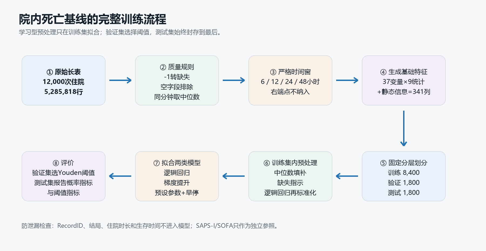

第一类模型是逻辑回归。它先计算一个加权分数 `z=b₀+Σbᵢxᵢ`，再通过 `p=1/(1+e⁻ᶻ)` 把任意大小的分数压缩成 0—1 之间的死亡概率。直观地看，每个标准化特征都会按照自己的系数把总风险向上或向下推动；在没有主动加入乘积项或非线性变换时，这些作用主要以加法方式组合。处理流程为训练集中位数填补、添加缺失指示、标准化，然后使用 `LogisticRegression`，求解器为 `lbfgs`，最大迭代次数 2,500，随机种子固定。它容易复现和审计，但不擅长自动表示复杂阈值与交互。

第二类模型是 `HistGradientBoostingClassifier`。它先把连续特征划入直方图区间，再用浅树把特征空间切成若干局部区域；第 `m` 棵树按照 `Fₘ(x)=Fₘ₋₁(x)+ηhₘ(x)` 修正前面模型尚未解释好的误差，最后同样把累计分数转换为概率。因为不同树可以使用不同特征和切分点，它能够自然表示“高于某个阈值后风险改变”以及多个指标共同出现时的交互。当前参数为学习率 0.05、最多 250 次迭代、最多 15 个叶节点、叶节点最少 30 个样本、L2 正则化 1.0，并启用早停。它使用与逻辑回归相同的训练集填补和缺失指示，但不需要标准化。参数是保守的预设基线，没有在测试集上调参。

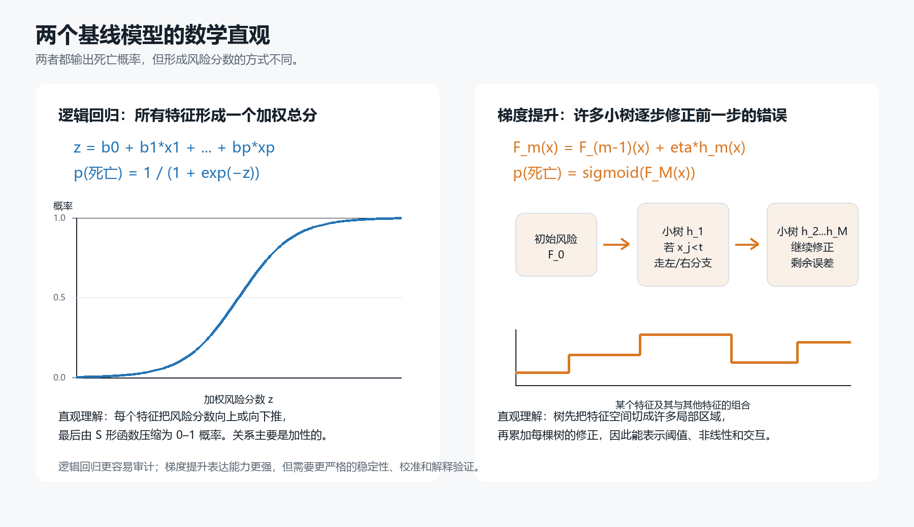

另有两个参照：静态逻辑回归只使用年龄、性别、身高、入院体重和 ICU 类型；评分逻辑回归只使用 SAPS-I 与 SOFA。每个训练完成的模型先在验证集输出概率，通过最大化 Youden J，即 `灵敏度 + 特异度 - 1`，选出一个分类阈值；该阈值原样应用于测试集。AUROC、AUPRC、Brier 和对数损失直接基于概率，不依赖这个阈值；灵敏度、特异度、精确率和 F1 则依赖阈值。验证集选择的 Youden 阈值只是一种统计学工作点，不代表经过临床成本、资源容量或决策曲线确认的临床阈值。

## 八、评价指标的含义

AUROC 是受试者工作特征曲线下面积。可以把它直观理解为：随机抽取一名死亡患者和一名存活患者，模型把死亡患者排在更高风险位置的概率。0.5 接近随机排序，1.0 表示完全分离。它综合考察所有可能阈值，适合评价排序能力，但在阳性比例较低时，即使 AUROC 较高，实际报警的阳性预测值仍可能不高。

AUPRC 是精确率—召回率曲线下面积，聚焦阳性类别。这里的召回率就是灵敏度，精确率是被模型判为高风险的人中实际死亡的比例。在随机排序下，AUPRC 的基线大致等于阳性率，因此本测试集的参照约为 0.142。相较于 AUROC，AUPRC 对类别不平衡和误报更敏感，特别适合本研究的死亡预测任务；但它也随人群死亡率变化，所以不同医院或不同队列的 AUPRC 不能脱离患病率直接比较。

Brier 分数是预测概率与真实 0/1 结局之间平方误差的平均值，即 `mean((p-y)^2)`，越低越好，理想值为 0。它同时受到区分度和校准影响：一个模型即使排序正确，如果给出的概率过高或过低，Brier 仍会变差。在死亡率为 14.225% 的队列中，始终预测总体死亡率的常数模型理论 Brier 约为 0.122；当前最佳模型为 0.084，说明概率预测优于这个简单参照，但仍需用校准曲线、校准截距和斜率进一步确认。

灵敏度等于 `TP/(TP+FN)`，表示实际死亡者中被模型识别为高风险的比例；提高灵敏度通常可以减少漏诊，但可能增加误报。特异度等于 `TN/(TN+FP)`，表示实际存活者中被模型正确判断为低风险的比例。二者都依赖分类阈值：降低阈值一般提高灵敏度、降低特异度，反之亦然。因此，“灵敏度 0.85、特异度 0.73”不是模型固定不变的属性，而是当前验证集 Youden 阈值对应的一个工作点。实际部署前，应根据漏报代价、报警容量和干预收益重新确定阈值。

## 九、院内死亡预测结果

测试集共有 1,800 例，其中死亡 256 例，死亡率 14.22%。下表全部使用验证集预先选定的阈值，测试集没有参与特征填补、模型训练或阈值优化。

| 特征集 | 模型 | 阈值 | AUROC | AUPRC | Brier | 灵敏度 | 特异度 | 精确率 | F1 |
|---|---|---:|---:|---:|---:|---:|---:|---:|---:|
| 静态信息 | 逻辑回归 | 0.177 | 0.711 | 0.261 | 0.114 | 0.551 | 0.744 | 0.263 | 0.356 |
| SAPS-I+SOFA 参照 | 逻辑回归 | 0.096 | 0.663 | 0.267 | 0.116 | 0.844 | 0.366 | 0.181 | 0.298 |
| 前 6 小时 | 逻辑回归 | 0.113 | 0.773 | 0.362 | 0.109 | 0.785 | 0.636 | 0.263 | 0.395 |
| 前 6 小时 | 梯度提升 | 0.160 | 0.806 | 0.387 | 0.104 | 0.699 | 0.755 | 0.321 | 0.440 |
| 前 12 小时 | 逻辑回归 | 0.135 | 0.790 | 0.364 | 0.108 | 0.719 | 0.716 | 0.295 | 0.419 |
| 前 12 小时 | 梯度提升 | 0.129 | 0.830 | 0.418 | 0.100 | 0.789 | 0.704 | 0.307 | 0.442 |
| 前 24 小时 | 逻辑回归 | 0.120 | 0.825 | 0.426 | 0.102 | 0.785 | 0.729 | 0.325 | 0.459 |
| 前 24 小时 | 梯度提升 | 0.146 | 0.856 | 0.520 | 0.092 | 0.777 | 0.769 | 0.358 | 0.490 |
| 前 48 小时 | 逻辑回归 | 0.119 | 0.862 | 0.536 | 0.091 | 0.789 | 0.762 | 0.355 | 0.490 |
| 前 48 小时 | 梯度提升 | 0.103 | **0.882** | **0.592** | **0.084** | **0.848** | 0.730 | 0.342 | 0.488 |

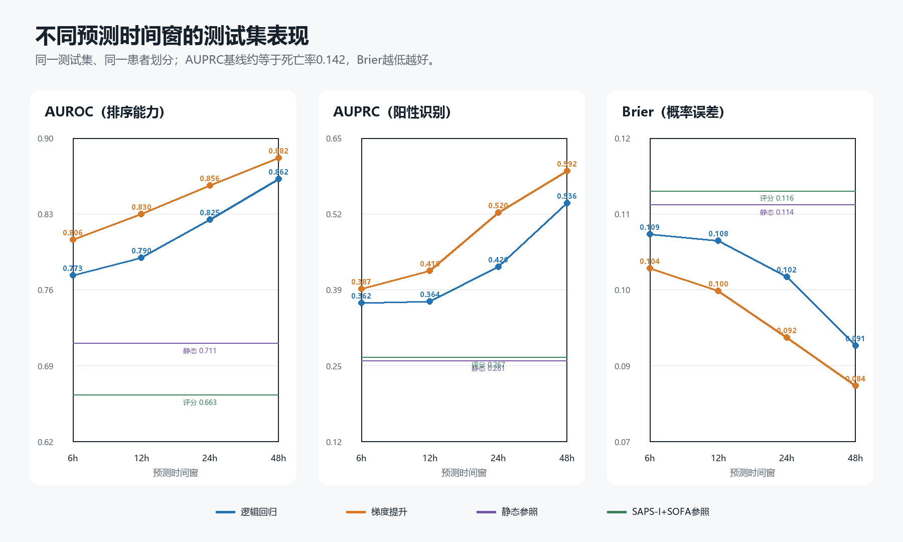

结果呈现两个稳定趋势。其一，原始临床记录模型明显优于只用静态信息或 SAPS-I/SOFA 的参照模型，说明测量值、变化趋势和测量行为提供了额外信息。其二，观察时间越长，逻辑回归和梯度提升的 AUROC、AUPRC 与 Brier 总体越好；从 6 小时到 48 小时，梯度提升的 AUROC 从 0.806 提高到 0.882，AUPRC 从 0.387 提高到 0.592，Brier 从 0.104 降至 0.084。这既反映患者轨迹中逐渐出现更多信号，也可能反映临床团队在 48 小时内形成的检查与治疗路径。

非线性梯度提升在所有时间窗都优于对应逻辑回归，优势在 24 小时最明显：AUROC 提高约 0.032，AUPRC 提高约 0.094。这说明变量之间可能存在非线性和交互，例如同一乳酸水平在不同尿量、血压或意识状态下具有不同风险。不过，单次划分的差异仍可能含抽样波动，尚不能据此断言某一算法在总体上必然优越。

对最佳 48 小时梯度提升模型作更直观的解释：256 名实际死亡患者中约 217 名被识别为高风险，约 39 名被漏掉；1,544 名实际存活患者中约 1,127 名被判断为低风险，约 417 名被误报为高风险。因为死亡率只有 14.22%，即使灵敏度达到 84.8%、特异度达到 73.0%，高风险组的精确率仍只有 34.2%。这正是不能只看 AUROC、也不能把验证集阈值直接变成临床报警阈值的原因。

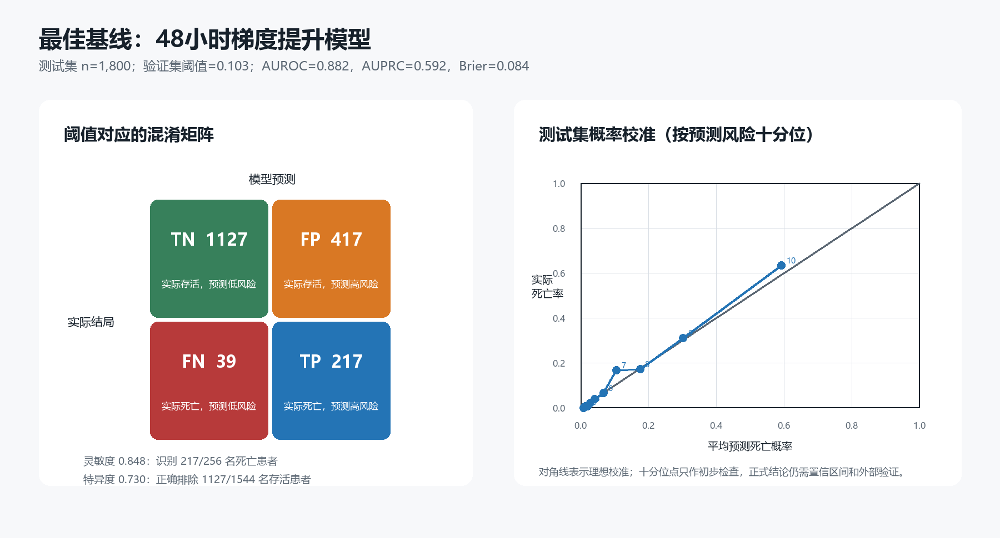

评分参照模型出现了较高灵敏度和较低特异度，是因为验证集 Youden 方法选择了较低阈值 0.096；这不表示 SAPS-I/SOFA 天生偏向高灵敏度。概率排序方面，其 AUROC 为 0.663，低于静态模型的 0.711，而 AUPRC 接近。由于评分的计算时间与早期窗口不完全匹配，这个参照仅提供方向性比较，不能视为对原始 Challenge 评分方案的严格复现。

### 9.1 第二阶段：填补与清洗稳健性

第二阶段固定预测问题、341 个特征和 8,400/1,800/1,800 的原始划分，只改变数据处理方案。由于实验 02 已经查看过最后 1,800 例的基线表现，本文将其称为“基线后重新锁定的确认集”，不再描述成研究全过程中从未查看过的盲测集。候选方案包括中位数填补但不加缺失指示、中位数或均值加缺失指示、梯度提升原生缺失、训练集 0.5%—99.5% 分位截断、宽松技术边界清洗，以及清洗与截断的组合；所有学习型预处理均只在当前训练折拟合。

24 小时训练集五折筛选中，逻辑回归最高 AUPRC 为原始数据加分位数截断的 0.4285，梯度提升最高为原始数据、中位数填补加缺失指示的 0.4712；不加缺失指示时为 0.4701。进入四个时间窗验证后，逻辑回归最终选择宽松清洗、截断、中位数与缺失指示的组合，梯度提升选择更简单的原始数据加中位数填补。最终梯度提升在 48 小时确认集取得 AUROC 0.882（95% CI 0.861—0.900）、AUPRC 0.592（0.536—0.651）和 Brier 0.084（0.076—0.093），与实验 02 基线完全重合。复杂清洗和填补没有形成跨模型、跨时间窗的一致收益，因此目前没有依据继续把 KNN 或迭代填补加入主比较。

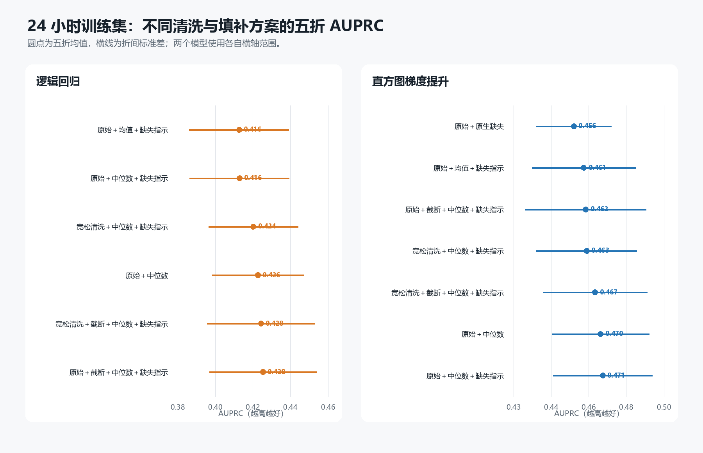

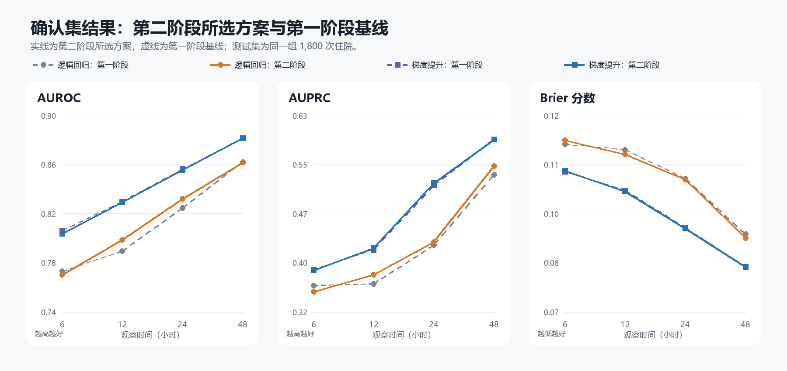

### 9.2 测量行为、校准与标签敏感性

实验 03 将临床数值、显式缺失指示和测量过程分别消融。仅使用测量次数、距末次测量时间和静态信息时，48 小时梯度提升 AUPRC 已达到 0.447，但仍明显低于完整模型的 0.592。这说明诊疗与记录行为本身包含风险信号，却不能替代实际生理数值；相应特征也可能随医院流程变化而失效。未校准 48 小时梯度提升的校准截距为 0.209、斜率为 1.106，高风险端存在轻度低估。

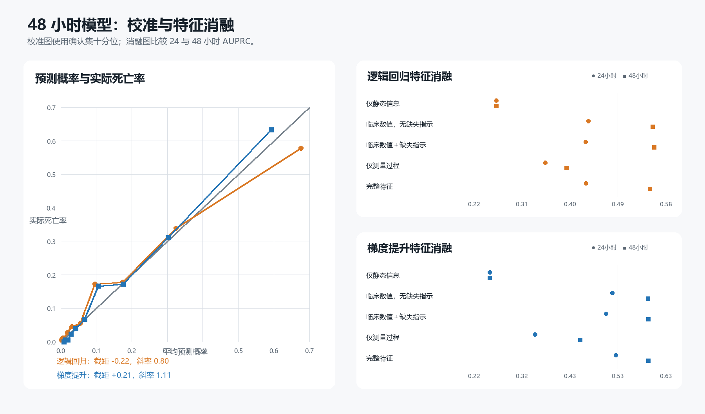

95 条硬规则结局异常在训练集、验证集和确认集中分别有 67、18 和 10 条。排除异常后重训并在相同严格确认集评价，48 小时梯度提升的 AUROC/AUPRC 由 0.879/0.570 变为 0.875/0.557，未改变总体模型排序；24 小时结果波动更明显，因此不能把少量异常的影响概括为所有时间窗都同样稳定。按死亡时间与住院时长差值 2、5、10 天逐级删除病例时，操作会选择性降低阳性率，AUPRC 和 Brier 不再能与主队列直接作高低比较，结果主要用于观察 AUROC 和模型排序是否突变。

### 9.3 补充分析：阈值、再校准与跨 ICU 压力测试

在实验 03 已选定的 48 小时梯度提升上，验证集 Platt 校准使确认集校准截距由 0.209 接近至 0.045、斜率由 1.106 接近至 1.030，Brier 仅由 0.08423 降至 0.08410；isotonic 没有进一步改善。这个内部结果支持把线性再校准作为新环境部署前的候选步骤，但不能代替使用新医院数据重新估计概率。

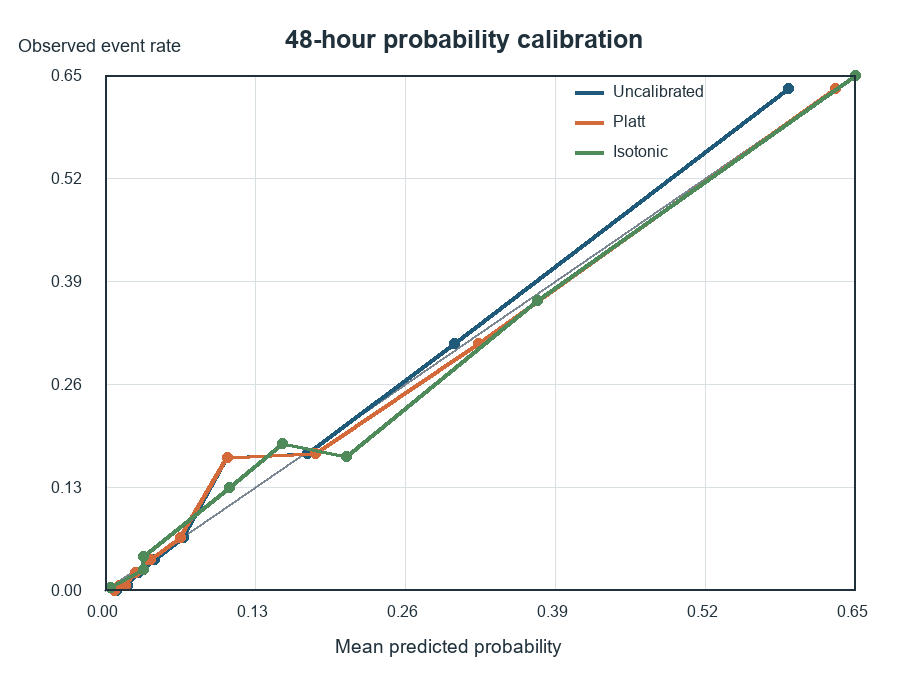

当验证集目标灵敏度依次设为 0.70、0.80、0.90 和 0.95 时，确认集灵敏度分别为 0.68、0.78、0.92 和 0.97；每 100 人告警数由 21.5 增至 53.1，漏诊死亡人数由 81 降至 8。这组结果不指定唯一阈值，而是把模型选择转化为复核容量、误报和漏诊之间的决策问题。

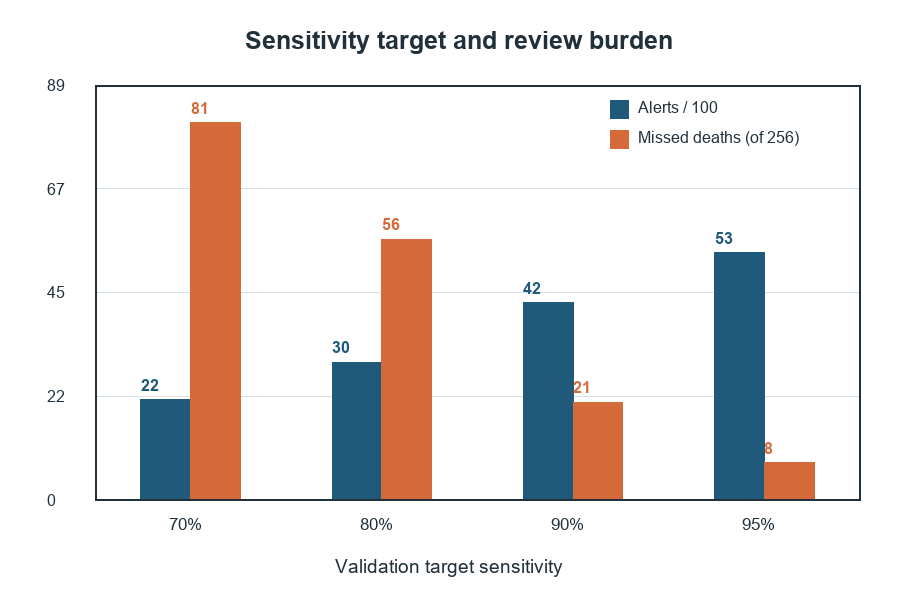

留一 ICU 类型实验在三类 ICU 上重新训练，在第四类 ICU 的全部病例上评价，并删除 ICU 类型输入。四类留出结果的 AUROC 为 0.815—0.878；平均预测风险在 CSRU 从实际 4.9% 高估到 9.4%，在 MICU 从实际 19.8% 低估到 15.6%。这比固定确认集上的亚组统计更接近分布变化压力测试，但四类 ICU 仍来自同一历史数据源，不是真正的医院外验证。

## 十、住院时长回归

### 10.1 问题定义与训练设计

住院时长回归使用入 ICU 后前 6、12、24、48 小时的静态信息、生命体征和实验室记录，预测从 ICU 入院到本次住院结束的总天数。`Length_of_stay` 缺失或记为 `-1` 的 167 例被排除；另有 5 例住院时长小于 2 天，与数据集的纳入条件矛盾，也不进入训练，最终纳入 11,828 例。这里的目标是医院总住院时长，不是 ICU 停留时间；死亡、转院和不同医院的出院制度都会影响它，因此模型预测的是现有诊疗流程下观察到的住院结束时间，而不是患者恢复所需的纯生物学时间。

数据按住院时长十分位固定划分为训练集 8,279 例、验证集 1,774 例和测试集 1,775 例。所有时间特征沿用死亡实验的摘要方法；连续输入按训练集 0.5% 和 99.5% 分位截尾，中位数填补、缺失指示和标准化参数也只从训练集学习。由于住院时长明显右偏，两类模型都拟合 `log(1+LOS)`：岭回归提供线性、可审计的基线，直方图梯度提升用于表达阈值、非线性和变量交互。时间窗和模型只按验证集 MAE 选择，最终方案再用训练集与验证集合并拟合，并在固定测试集上评价。

### 10.2 模型结果

| 时间窗 | 模型 | MAE（天） | RMSE（天） | 中位绝对误差（天） | R² | Spearman |
|---:|---|---:|---:|---:|---:|---:|
| 6 小时 | 直方图梯度提升 | 7.03 | 13.47 | 4.07 | 0.055 | 0.407 |
| 6 小时 | 岭回归 | 7.17 | 13.62 | 4.13 | 0.035 | 0.363 |
| 12 小时 | 直方图梯度提升 | 7.04 | 13.50 | 4.13 | 0.051 | 0.410 |
| 12 小时 | 岭回归 | 7.11 | 13.60 | 3.97 | 0.037 | 0.377 |
| 24 小时 | 直方图梯度提升 | 6.97 | 13.41 | 4.07 | 0.064 | 0.436 |
| 24 小时 | 岭回归 | 7.06 | 13.42 | 4.03 | 0.062 | 0.403 |
| 48 小时 | 直方图梯度提升 | 6.73 | 13.20 | 3.73 | 0.092 | 0.509 |
| 48 小时 | 岭回归 | 6.89 | 13.33 | 3.80 | 0.075 | 0.456 |

训练集中位数基线的测试集 MAE 为 7.58 天。验证集选出的方案是前 48 小时直方图梯度提升；合并训练集和验证集重新拟合后，测试集 MAE 为 6.68 天，患者记录级 Bootstrap 95% 置信区间为 6.17—7.24 天；RMSE 为 13.21 天，R² 为 0.091。模型虽然优于简单基线，但较低的 R² 和明显高于 MAE 的 RMSE 表明，少数长住院患者仍产生较大的预测误差。

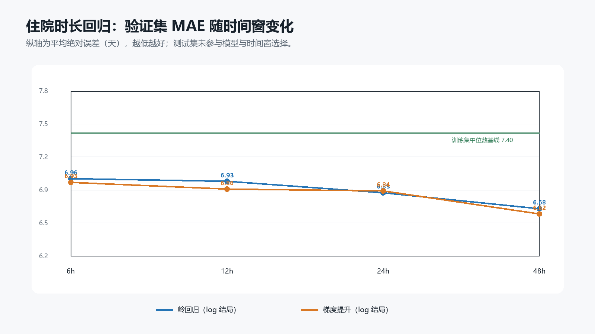

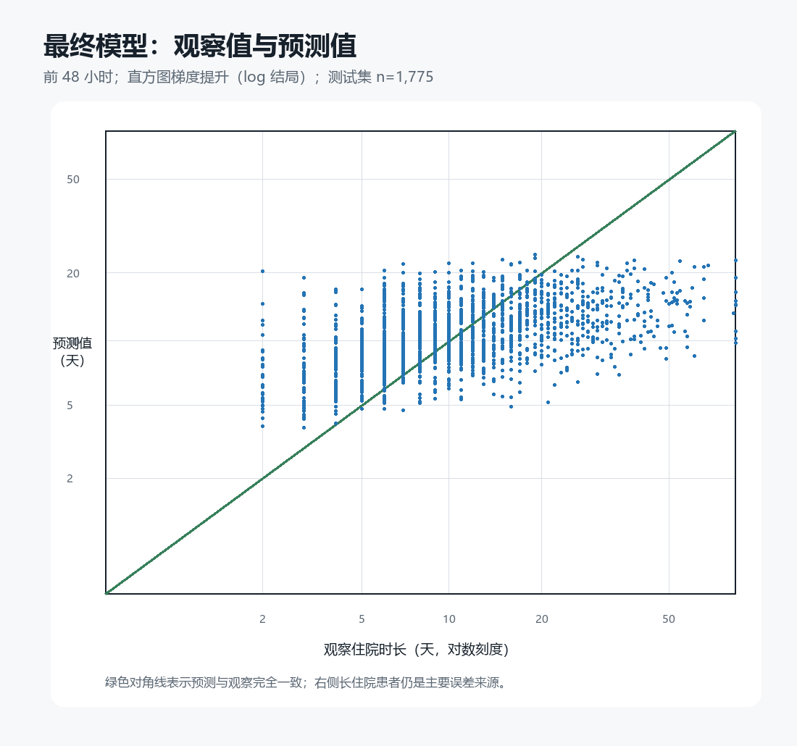

存活出院者的 MAE 为 6.34 天，院内死亡者为 8.61 天。死亡结局没有进入模型，这一差异提示死亡会提前结束住院，是不能忽略的竞争事件。因此，当前模型只能作为总住院时长的内部基线，不能向个人承诺具体出院日期。下一阶段应把目标改为预测时点之后的“剩余住院时间”，只纳入该时点仍在院者，并同时评价个体 MAE、长住院误差和队列总剩余床日偏差；对数回归还应比较直接反变换与 smearing 校正，区分个体中位数式预测和队列均值估计。

### 10.3 48 小时后的剩余住院时间

上述任务已经进一步改写为 `剩余住院时间=Length_of_stay−2 天`。岭回归、Lasso、直方图梯度提升和随机森林均拟合 `log(1+剩余天数)`，超参数只根据验证集选择。个体预测以直接反变换 MAE 为标准，选中梯度提升；合并训练集和验证集重拟合后，测试集 MAE 为 6.62 天（95% CI 6.12—7.16），中位绝对误差为 3.67 天，R² 为 0.096。它优于训练集中位数基线的 7.52 天，但直接反变换低估测试队列总床日 24.5%。

队列容量估计另以验证集 smearing 后总床日绝对偏差选择模型，最终选中岭回归。测试集实际剩余床日为 20,797 天，预测为 20,637 天，总量偏差 −0.77%，Bootstrap 95% CI 为 −5.37%—4.82%；但其个体 MAE 为 7.22 天。两种读数不能混用：梯度提升更适合内部比较个体绝对误差，smearing 岭回归只显示总体均值较接近。

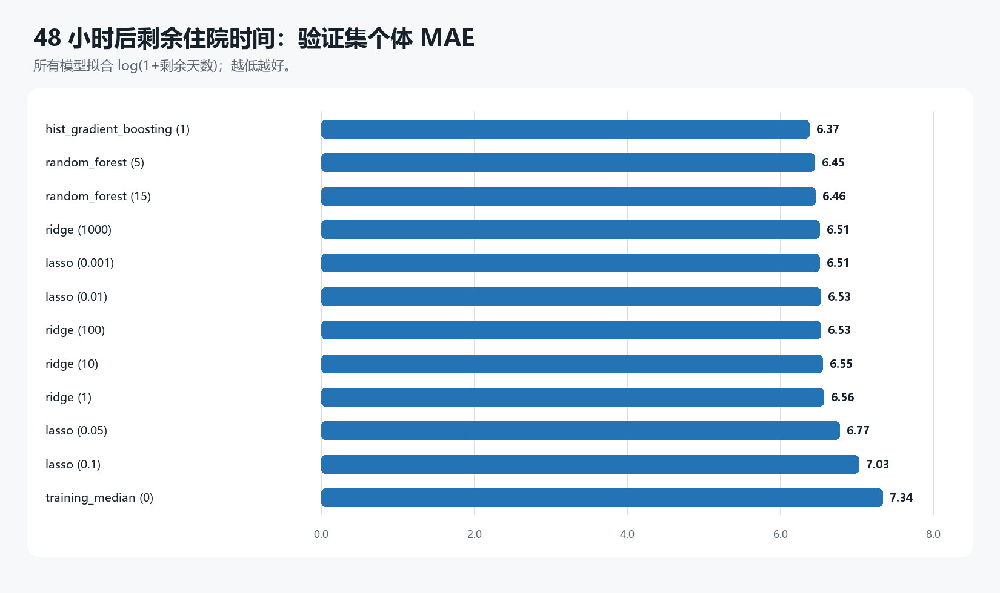

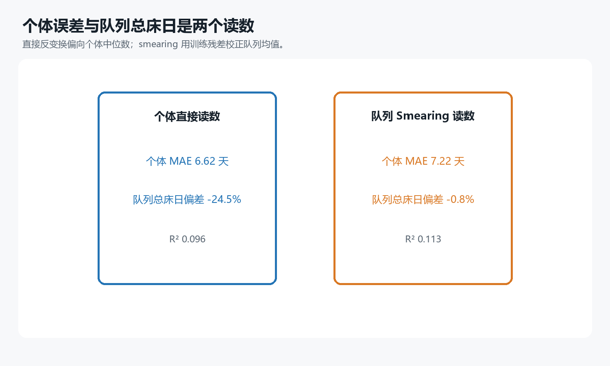

队列总体接近仍掩盖了明显亚组误差：smearing 岭回归在 CSRU 高估约 12.9%，在 MICU 和 SICU 分别低估约 4.7% 和 5.0%；住院总时长至少 25 天者只占测试集约 12.8%，却拥有约 40.6% 的剩余床日，该组仍被低估约 56.7%。因此，当前结果可以用于解释“个体预测与容量估计为什么需要不同目标”，还不足以作为病区排床或个人出院日期工具。

## 十一、24 小时患者表型聚类

### 11.1 无监督问题与簇数选择

聚类实验考察在不使用结局标签的情况下，患者入 ICU 后 24 小时的临床状态能否形成相对稳定的亚群。输入由年龄、性别、初始体重以及神经状态、生命体征、血压、肾功能、血常规、电解质、血气、机械通气记录和尿量等 24 个特征组成。SAPS-I、SOFA、死亡、住院时长和生存时间均未参与预处理、PCA、聚类或簇数选择；测量次数和距末次测量时间也被排除，以减少模型仅按医疗流程分组的风险。

全部 12,000 次住院按 ICU 类型分层划为 70% 聚类训练集和 30% 留出集。1%—99% 分位截尾、中位数填补和标准化均只从训练集估计。PCA 保留 14 个主成分，累计解释 81.1% 的训练集方差；随后用 K-means 比较 `k=2—8`。选择规则先要求训练集 20 次 80% 子样本的稳定性 ARI 中位数至少为 0.75、最小簇至少占 5%，再选择留出集轮廓系数最高的方案，最终得到 `k=4`。

最终四簇方案的留出集轮廓系数为 0.119，子样本稳定性 ARI 中位数为 0.980。两项指标回答的是不同问题：较高 ARI 表明这种粗粒度划分在重复抽样中容易复现，较低轮廓系数则说明各簇在特征空间中仍有大量重叠。因此，它们更适合解释为连续临床状态上的几组患者，而不是边界清楚的四种疾病。


### 11.2 簇画像与解释边界

| 簇 | 样本数 | 占比 | 院内死亡率 | 住院时长中位数（IQR，天） | 平均特征缺失率 |
|---:|---:|---:|---:|---:|---:|
| 1 | 1,319 | 11.0% | 28.3% | 12.0（7.0—20.0） | 7.7% |
| 2 | 3,740 | 31.2% | 14.4% | 10.0（7.0—17.0） | 2.5% |
| 3 | 2,836 | 23.6% | 15.4% | 11.0（7.0—19.0） | 2.6% |
| 4 | 4,105 | 34.2% | 8.7% | 8.0（5.0—14.0） | 15.8% |

死亡率和住院时长只在簇确定之后用于描述，没有参与建簇或模型选择，因此簇间结局差异不能解释为因果效应，也不能反过来把簇直接命名为“高风险型”或“低风险型”。簇 1 主要表现为较高的肌酐、BUN 和钾，以及较低的 HCO3、尿量和体温；簇 4 的缺失率最高，同时死亡率最低，它可能部分反映检查和照护强度，而不完全是独立生理表型。聚类与 ICU 类型的标准化互信息为 0.111，提示分组并非只是简单复现原有科室分流，但也不能据此证明存在新的临床疾病实体。


下一阶段应在不同填补方法、纯生理特征与测量行为特征、12/24/48 小时时间窗以及 K-means、层次聚类和高斯混合模型之间检查共识程度。只有当相近画像能够跨预处理、抽样和算法重复出现，并经过临床人员审核，才适合进一步命名和解释。聚类属于探索性扩展，不替代课程要求的两个监督预测任务。

## 十二、当前主线与其他机器学习任务的边界

“现阶段能够开展的机器学习任务”描述的是这份数据可以形成哪些不同研究问题；“后续实验方案”描述的是在同一个研究问题内，下一步具体改变哪些处理条件并怎样比较。二者的目标变量、样本定义和评价指标可能不同，因此不能全部接在同一条实验流水线上。本研究当前主线固定为院内死亡二分类；已经完成的第二阶段只比较数据填补、异常清洗、标签敏感性和验证方法，仍使用相同死亡标签与 6、12、24、48 小时预测窗。

动态死亡风险虽然仍属于死亡预测，但它把“每名患者一个固定时点的预测”改成“每名患者多个时点的连续更新”，训练样本相关性、预测提前量和评价方法都会改变，因此应作为主线稳定后的独立实验。深度时序模型同样属于死亡预测算法扩展，不应与本轮数据清洗试验同时改变。

住院时长则是另一个结局，可以开展回归、分位数回归或长住院分类，但要处理右偏、长尾和死亡竞争事件。无监督表型发现没有预先定义的标签，需要以聚类稳定性、临床解释和外部重复性评价。异常检测以识别单位错误、设备伪差和异常录入为目标，也有独立的验证标准。这些任务应在院内死亡二分类的数据处理方案确定后另立实验，避免因问题定义同时变化而无法解释结果。当前第二阶段已经给出这一主线的数据处理结论，其他分支可以在不改写本实验比较逻辑的前提下独立开展。

本仓库把死亡预测的第二阶段及其部署导向补充统一放在 `Experiments/03_mortality_data_quality/`，不再保留内容重复的独立稳健性实验。总住院时长、患者聚类和剩余住院时间分别位于 `Experiments/04_length_of_stay_regression/`、`05_patient_phenotype_clustering/` 和 `06_remaining_length_of_stay/`。这些任务共享经过审计的数据规则，但保留独立问题定义、选择标准与输出，避免把不同结局的结果混成同一次模型比较。

## 十三、局限性

第一，死亡模型已增加训练集五折预处理比较和确认集 Bootstrap 区间，住院时间也提供患者记录级 Bootstrap，但所有数据仍来自同一历史数据集，不能替代时间外和医院外确认。第二，本地数据没有医院、日期和患者身份，无法验证跨医院泛化、随时间漂移或同一患者重复住院造成的相关性。第三，缺失和测量频率含有临床流程信息；缺失模式模型已经量化这种信息的存在，却不能把诊疗行为与患者自然病程分离。

第四，医学范围清洗目前是缓存摘要层面的敏感性处理，还没有回到每条原始观测、经临床专家审核后重新计算全部统计量。第五，SAPS-I/SOFA 参照不是严格时间匹配，不能作为完全公平的早期评分对照。第六，临床工作点只展示灵敏度和告警容量的权衡，尚没有真实干预成本、净获益或前瞻工作流评估。第七，Platt 校准和跨 ICU 压力测试仍属于内部分析；新医院使用前需要独立校准和验证。第八，剩余住院时间受死亡竞争事件和长尾影响，总量误差还可能因亚组正负偏差抵消；聚类虽有较高重复抽样稳定性，簇间分离度却较低，尚无临床专家或外部队列确认。第九，原始 Challenge 数据并未排除所有 DNR/CMO 患者，预测可能受到治疗限制与临床决策影响；模型只能描述现有照护过程下的结局风险，不能解释治疗效果。

## 十四、已完成的稳健性实验与下一步

预处理五折比较、缺失模式消融、Bootstrap、Platt/Isotonic 校准、多个灵敏度工作点、年龄与 ICU 亚组、跨 ICU 类型压力测试、95 条硬性结局异常和死亡—住院日期差值敏感性均已完成。主要结论是简单的中位数方案已经足够稳定，缺失指示是否保留没有形成一致增益，继续增加 KNN 或迭代填补的预期收益较低；完整生理数值提供了主要性能，但测量流程贡献不可忽略；排序在 ICU 类型变化下相对稳定，概率水平需要重新校准；少量硬性结局错误不会解释总体结果。

仍值得继续的死亡实验只剩三类。第一是由临床人员审核原始观测级异常范围，再重新生成摘要，验证当前缓存层敏感性结论。第二是对最终逻辑回归和梯度提升进行成组置换重要度或 SHAP 分析，明确生理数值、趋势与测量行为分别贡献多少；解释结果只描述关联，不推断治疗因果效应。第三是如果能够获得医院、日期或新的病例，再进行真正时间外或医院外验证。在现有数据没有这些字段时，不建议用更多随机划分冒充外部验证，也不优先增加深度时序模型。

聚类的下一步保持为附录级敏感性：比较纯生理特征与测量行为特征，并检查不同填补和算法下是否出现相近画像。只有课程汇报时间充足、且死亡和剩余住院时间两条监督主线已经冻结后，才开展这一部分。

## 十五、复现方式与文件索引

从仓库根目录安装依赖后，可以依次运行以下分析。所有脚本只读取 `release/` 原始文件，汇总结果写入各自的 `output/`，不会修改原始数据。

```bash
# 当原始数据按 README 放在仓库内的 release/ 时
python EDA/eda.py
python EDA/correlation_analysis.py
python EDA/outcome_consistency_audit.py
python Experiments/01_length_of_stay_by_mortality/run_experiment.py

# 当前工作区的原始数据位于仓库同级目录 ../release
python Experiments/02_mortality_prediction_baseline/run_experiment.py --data-dir ../release
python Experiments/03_mortality_data_quality/run_experiment.py --data-dir ../release
python Experiments/03_mortality_data_quality/analyze_selected_models.py --data-dir ../release
python Experiments/03_mortality_data_quality/analyze_operating_points.py
python Experiments/03_mortality_data_quality/plot_results.py
python Experiments/04_length_of_stay_regression/run_experiment.py --data-dir ../release
python Experiments/05_patient_phenotype_clustering/run_experiment.py --data-dir ../release
python Experiments/06_remaining_length_of_stay/run_experiment.py --data-dir ../release
```

前三个已有脚本当前固定从仓库内的 `release/` 读取数据；实验 02 和实验 03 支持 `--data-dir`，本次全量训练实际使用了同级的 `../release`。若在另一台机器复现，应遵照根目录 README 准备数据，或为两个死亡预测实验显式指定私有数据目录。

研究过程的主要文件为：

| 内容 | 文件 |
|---|---|
| 数据字段和编码 | `release/README.md` |
| 全量 EDA 方法与汇总 | `EDA/REPORT.md` |
| 相关性分析 | `EDA/CORRELATION_REPORT.md` |
| 结局字段一致性审计 | `EDA/outcome_consistency_audit.py`、`EDA/output/Distribution/outcome_consistency_summary.csv` |
| 住院时长描述实验 | `Experiments/01_length_of_stay_by_mortality/README.md` |
| 死亡预测训练代码 | `Experiments/02_mortality_prediction_baseline/run_experiment.py` |
| 死亡预测测试结果 | `Experiments/02_mortality_prediction_baseline/output/metrics.csv` |
| 分时间窗覆盖率 | `Experiments/02_mortality_prediction_baseline/output/feature_coverage.csv` |
| 样本、特征与质量计数 | `Experiments/02_mortality_prediction_baseline/output/run_metadata.json` |
| 报告图表生成 | `Experiments/02_mortality_prediction_baseline/plot_report_figures.py` |
| 填补、清洗、工作点与内部可迁移性 | `Experiments/03_mortality_data_quality/README.md` |
| 五折、验证和确认集汇总 | `Experiments/03_mortality_data_quality/output/cv_summary.csv`、`validation_candidates.csv`、`test_metrics.csv` |
| 标签、校准、消融和亚组结果 | `Experiments/03_mortality_data_quality/output/label_sensitivity_metrics.csv`、`calibration_metrics.csv`、`feature_ablation_metrics.csv`、`subgroup_metrics.csv` |
| 第二阶段分析与绘图代码 | `Experiments/03_mortality_data_quality/analyze_selected_models.py`、`analyze_operating_points.py`、`plot_results.py` |
| 住院时长回归报告与结果 | `Experiments/04_length_of_stay_regression/README.md`、`output/primary_test_metrics.csv` |
| 24 小时患者分型报告与结果 | `Experiments/05_patient_phenotype_clustering/README.md`、`output/model_selection_metrics.csv` |
| 48 小时后剩余住院时间 | `Experiments/06_remaining_length_of_stay/README.md`、`output/primary_test_metrics.csv` |

患者级预测、固定划分和第二阶段特征缓存存放在各实验被 Git 忽略的 `output/data/`，避免重新分发患者级原始衍生数据。当前运行环境使用 scikit-learn 1.9.0，随机种子为 20260904；最终特征数、质量计数、候选方案和版本信息也保存在元数据文件中。

## 十六、时序变量覆盖率附表

下表的覆盖率表示 12,000 次住院中至少有一次有效测量的比例；“观测中位数”只在至少测到一次该变量的住院中计算。

| 变量 | 单位 | 覆盖率 | 观测中位数 |
|---|---|---:|---:|
| BUN | mg/dL | 98.48% | 3 |
| Creatinine | mg/dL | 98.48% | 3 |
| HR | bpm | 98.47% | 55 |
| Temp | ℃ | 98.46% | 14 |
| GCS | 3—15 | 98.46% | 13 |
| HCT | % | 98.42% | 4 |
| Platelets | cells/nL | 98.35% | 3 |
| HCO3 | mmol/L | 98.28% | 3 |
| Na | mEq/L | 98.23% | 3 |
| WBC | cells/nL | 98.23% | 3 |
| K | mEq/L | 97.93% | 3 |
| Mg | mmol/L | 97.57% | 3 |
| Glucose | mg/dL | 97.55% | 3 |
| Urine | mL | 97.42% | 38 |
| Weight | kg | 92.36% | 41 |
| NISysABP | mmHg | 87.60% | 26 |
| NIDiasABP | mmHg | 87.24% | 26 |
| NIMAP | mmHg | 87.20% | 26 |
| pH | 0—14 | 75.91% | 7 |
| PaCO2 | mmHg | 75.46% | 7 |
| PaO2 | mmHg | 75.45% | 7 |
| SysABP | mmHg | 70.23% | 53 |
| DiasABP | mmHg | 70.22% | 53 |
| MAP | mmHg | 70.07% | 52 |
| FiO2 | 0—1 | 67.63% | 13 |
| MechVent | 0/1（本地有效值仅见 1） | 63.18% | 13 |
| Lactate | mmol/L | 54.80% | 2 |
| SaO2 | % | 44.73% | 3 |
| Bilirubin | mg/dL | 43.45% | 1 |
| AST | IU/L | 43.45% | 1 |
| ALT | IU/L | 43.44% | 1 |
| ALP | IU/L | 42.48% | 1 |
| Albumin | g/dL | 40.59% | 1 |
| RespRate | bpm | 27.73% | 49 |
| TroponinT | μg/L | 21.98% | 2 |
| Cholesterol | mg/dL | 7.90% | 1 |
| TroponinI | μg/L | 4.71% | 2 |

## 参考资料

1. PhysioNet. [Predicting Mortality of ICU Patients: The PhysioNet/Computing in Cardiology Challenge 2012](https://physionet.org/content/challenge-2012/1.0.0/).
2. Silva I, Moody G, Scott DJ, Celi LA, Mark RG. [Predicting In-Hospital Mortality of ICU Patients: The PhysioNet/Computing in Cardiology Challenge 2012](https://cinc.org/archives/2012/pdf/0245.pdf). *Computing in Cardiology*. 2012;39:245–248.
3. Ferreira FL, Bota DP, Bross A, Mélot C, Vincent JL. [Serial Evaluation of the SOFA Score to Predict Outcome in Critically Ill Patients](https://pubmed.ncbi.nlm.nih.gov/11594901/). *JAMA*. 2001;286(14):1754–1758.
